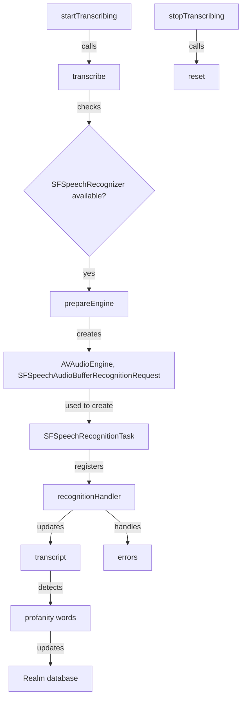
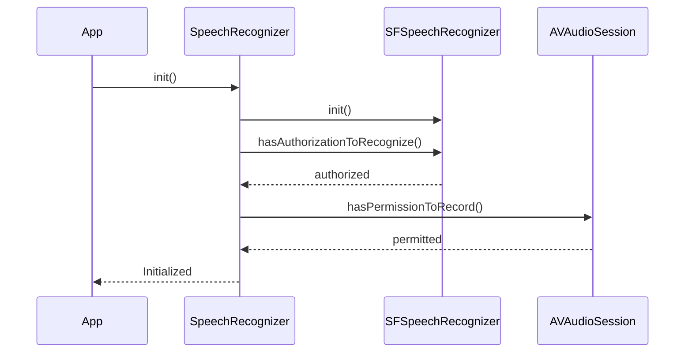
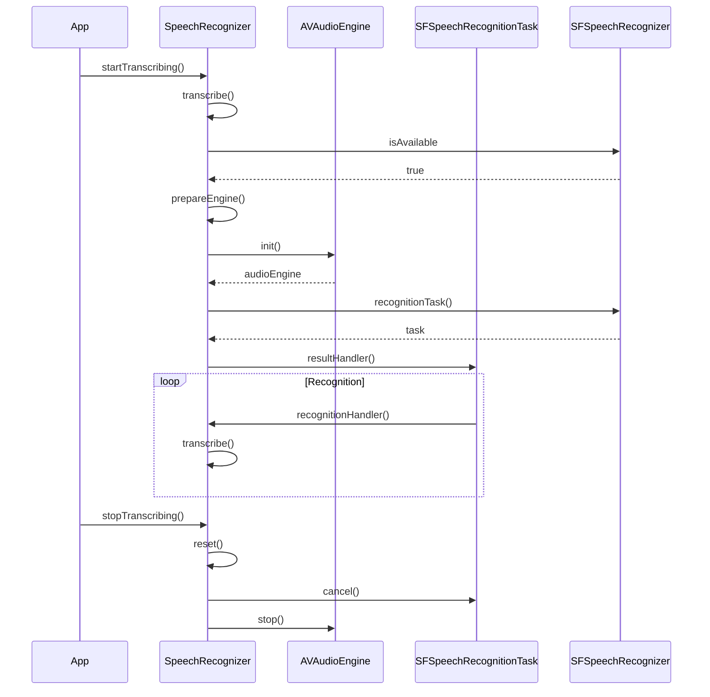

<details>
<summary>Relevant source files</summary>

The following file was used as context for generating this wiki page:

- [Scrumdinger/Models/SpeechRecognizer.swift](https://github.com/agattani123/swear-jar/blob/main/Scrumdinger/Models/SpeechRecognizer.swift)

</details>

# Speech Recognition Integration

## Introduction

The "Speech Recognition Integration" feature in this project provides functionality for transcribing speech to text using the `SFSpeechRecognizer` and `AVAudioEngine` classes from the `Speech` and `AVFoundation` frameworks, respectively. It also includes additional logic for detecting and counting profanity words in the transcribed text, as well as persisting user data and profanity counts using the Realm database.

The core functionality is encapsulated within the `SpeechRecognizer` actor class, which serves as a helper for managing the speech recognition process and handling the resulting transcriptions. This class is designed to be used in conjunction with SwiftUI views to enable speech-to-text capabilities within the application.

Sources: [Scrumdinger/Models/SpeechRecognizer.swift]()

## Architecture and Components

### SpeechRecognizer Actor

The `SpeechRecognizer` class is an actor, which means it enforces thread-safe access to its mutable state and methods. This is crucial when dealing with speech recognition tasks, as they involve asynchronous operations and potential race conditions.

```swift
actor SpeechRecognizer: ObservableObject {
    // ...
}
```

Sources: [Scrumdinger/Models/SpeechRecognizer.swift:14]()

#### Properties

The `SpeechRecognizer` class has the following key properties:

- `transcript`: A `String` that holds the transcribed text from the speech recognition process.
- `profanityCount`: An `Int` that keeps track of the number of profanity words detected in the transcribed text.
- `audioEngine`: An optional `AVAudioEngine` instance used for capturing audio input.
- `request`: An optional `SFSpeechAudioBufferRecognitionRequest` instance used for processing the audio input.
- `task`: An optional `SFSpeechRecognitionTask` instance that performs the actual speech recognition.
- `recognizer`: An optional `SFSpeechRecognizer` instance, which is the core component for speech recognition.
- `realm`: A `Realm` instance for persisting user data and profanity counts.
- `users`: A `Results<UserInfo>` object that holds the user information retrieved from the Realm database.
- `lastString`: A `String` that stores the last transcribed text for comparison purposes.
- `oldScore`: An `Int` that holds the previous profanity score for the user.
- `profanitySet`: An array of `String` objects containing the list of profanity words.

Sources: [Scrumdinger/Models/SpeechRecognizer.swift:16-31]()

#### Initialization

The `init()` method initializes a new `SpeechRecognizer` instance and performs the following tasks:

1. Creates a new `SFSpeechRecognizer` instance.
2. Retrieves the user's username and password from `UserDefaults`.
3. Queries the Realm database for the user's information based on the username and password.
4. If a user is found, it initializes the `oldScore` and `profanitySet` properties with the user's data.
5. Checks if the `recognizer` instance is not `nil`.
6. Requests authorization for speech recognition and microphone access asynchronously.

```swift
init() {
    // ...
}
```

Sources: [Scrumdinger/Models/SpeechRecognizer.swift:34-62]()

#### Methods

The `SpeechRecognizer` class provides the following methods:

- `resetProfanity()`: Resets the `profanitySet` property by fetching the user's profanity set from the Realm database.
- `startTranscribing()`: Initiates the speech recognition process by calling the `transcribe()` method.
- `resetTranscript()`: Resets the speech recognition process by calling the `reset()` method.
- `stopTranscribing()`: Stops the speech recognition process by calling the `reset()` method.
- `getProfanity()`: Fetches the user's profanity set from the Realm database and updates the `profanitySet` property.
- `transcribe()`: Starts the speech recognition process by creating an `AVAudioEngine` instance, a `SFSpeechAudioBufferRecognitionRequest` instance, and a `SFSpeechRecognitionTask` instance. It also handles the recognition result and error callbacks.
- `reset()`: Resets the speech recognition process by canceling the current task, stopping the audio engine, and clearing the related properties.
- `prepareEngine()`: A static method that sets up the `AVAudioEngine` and `SFSpeechAudioBufferRecognitionRequest` instances for speech recognition.
- `recognitionHandler()`: A helper method that handles the speech recognition result and error callbacks.
- `transcribe(_:)`: A helper method that updates the `transcript` property with the transcribed text and detects and counts profanity words. It also updates the user's profanity score in the Realm database.
- `transcribe(_:)`: A helper method that updates the `transcript` property with an error message in case of an error during the speech recognition process.

Sources: [Scrumdinger/Models/SpeechRecognizer.swift:64-212]()

### Data Flow

The speech recognition process follows this general flow:

1. The `startTranscribing()` method is called, which in turn calls the `transcribe()` method.
2. The `transcribe()` method checks if the `SFSpeechRecognizer` instance is available and authorized for speech recognition.
3. If authorized, it calls the `prepareEngine()` method to set up the `AVAudioEngine` and `SFSpeechAudioBufferRecognitionRequest` instances.
4. A `SFSpeechRecognitionTask` instance is created using the `recognizer` and `request` instances.
5. The `recognitionHandler()` method is registered as the result handler for the `SFSpeechRecognitionTask`.
6. As the speech recognition task progresses, the `recognitionHandler()` method is called with the recognition results or errors.
7. The `recognitionHandler()` method updates the `transcript` property and handles errors using the `transcribe(_:)` helper methods.
8. The `transcribe(_:)` method detects and counts profanity words in the transcribed text and updates the user's profanity score in the Realm database.
9. The `stopTranscribing()` method can be called to stop the speech recognition process by calling the `reset()` method.



Sources: [Scrumdinger/Models/SpeechRecognizer.swift:64-212]()

### Realm Integration

The `SpeechRecognizer` class integrates with the Realm database to persist user data and profanity counts. The `UserInfo` object is used to store the user's username, password, profanity set, frequency map, and total profanity score.

```swift
let realm = try! Realm()
let users: Results<UserInfo>
```

When a new `SpeechRecognizer` instance is created, it retrieves the user's information from the Realm database based on the username and password stored in `UserDefaults`. If a user is found, the `oldScore` and `profanitySet` properties are initialized with the user's data.

```swift
init() {
    // ...
    let savedUsername = UserDefaults.standard.object(forKey: "username") as? String ?? ""
    let savedPassword = UserDefaults.standard.object(forKey: "password") as? String ?? ""
    users = realm.objects(UserInfo.self).where{
        $0.password == savedPassword && $0.username == savedUsername
    }
    if let user = users.first {
        oldScore = user.totalScore
        for word in user.profanitySet {
            profanitySet.append(word)
        }
    }
    // ...
}
```

Sources: [Scrumdinger/Models/SpeechRecognizer.swift:40-53]()

When profanity words are detected in the transcribed text, the `transcribe(_:)` method updates the user's profanity score and frequency map in the Realm database.

```swift
nonisolated private func transcribe(_ message: String) {
    Task { @MainActor in
        // ...
        if let user = users.first {
            try! realm.write {
                for key in map.keys {
                    user.freqMap[key] = (user.freqMap[key] ?? 0) + map[key]!
                }
                user.totalScore = 0
                for key in user.freqMap.keys {
                    user.totalScore = user.totalScore + (user.freqMap[key] ?? 0)
                }
            }
        }
        // ...
    }
}
```

Sources: [Scrumdinger/Models/SpeechRecognizer.swift:151-163]()

## Sequence Diagrams

### Speech Recognition Initialization



Sources: [Scrumdinger/Models/SpeechRecognizer.swift:34-62](), [Scrumdinger/Models/SpeechRecognizer.swift:194-203](), [Scrumdinger/Models/SpeechRecognizer.swift:206-213]()

### Speech Recognition Process



Sources: [Scrumdinger/Models/SpeechRecognizer.swift:67-105](), [Scrumdinger/Models/SpeechRecognizer.swift:108-120](), [Scrumdinger/Models/SpeechRecognizer.swift:123-136](), [Scrumdinger/Models/SpeechRecognizer.swift:139-165]()

## Profanity Detection and Counting

The `SpeechRecognizer` class includes functionality for detecting and counting profanity words in the transcribed text. This is implemented in the `transcribe(_:)` method, which is called by the `recognitionHandler()` method with the transcribed text.

Here's a breakdown of the profanity detection and counting process:

1. The transcribed text is converted to lowercase.
2. The text is split into individual words using the `components(separatedBy: " ")` method.
3. A dictionary `map` is created to store the frequency of each profanity word.
4. For each word in the transcribed text:
   - If the word is present in the `profanitySet`, it is considered a profanity word.
   - The frequency of the profanity word is updated in the `map` dictionary.
   - The `profanityCount` property is incremented.
   - The device vibrates using `UIDevice.vibrate()` to provide feedback.
5. If a user is found in the Realm database:
   - A write transaction is initiated on the Realm database.
   - For each profanity word in the `map` dictionary:
     - The frequency of the word in the user's `freqMap` is updated.
   - The user's `totalScore` is recalculated based on the updated `freqMap`.

```swift
nonisolated private func transcribe(_ message: String) {
    Task { @MainActor in
        transcript = String(message.lowercased().suffix(max(message.count - lastString.count, 0)))
        let components = transcript.components(separatedBy: " ")
        var map = [String : Int]()
        for word in components {
            if (await profanitySet.contains(word)) {
                if map.keys.contains(word) {
                    map[word]! += 1
                } else {
                    map[word] = 1
                }
                profanityCount = profanityCount + 1
                UIDevice.vibrate()
            }
        }
        if let user = users.first {
            try! realm.write {
                for key in map.keys {
                    user.freqMap[key] = (user.freqMap[key] ?? 0) + map[key]!
                }
                user.totalScore = 0
                for key in user.freqMap.keys {
                    user.totalScore = user.totalScore + (user.freqMap[key] ?? 0)
                }
            }
        }
        lastString = message.lowercased()
    }
}
```

Sources: [Scrumdinger/Models/SpeechRecognizer.swift:139-165](), [Scrumdinger/Models/SpeechRecognizer.swift:218-220]()

## Key Features and Components

| Feature/Component | Description |
| --- | --- |
| `SpeechRecognizer` | An actor class that manages the speech recognition process and handles transcribed text. |
| `SFSpeechRecognizer` | The core component from the `Speech` framework that performs speech recognition. |
| `AVAudioEngine` | An `AVFoundation` component used for capturing audio input. |
| `SFSpeechAudioBufferRecognitionRequest` | A request object used for processing the audio input for speech recognition. |
| `SFSpeechRecognitionTask` | A task object that performs the actual speech recognition. |
| Profanity Detection | Functionality for detecting and counting profanity words in the transcribed text. |
| Realm Integration | Integration with the Realm database for persisting user data and profanity counts. |
| `UserInfo` | A Realm object that stores user information, including profanity set, frequency map, and total profanity score. |

Sources: [