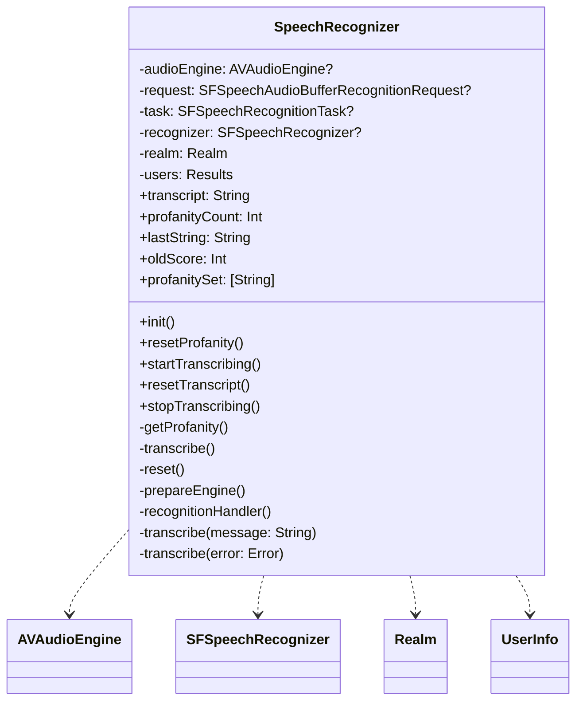
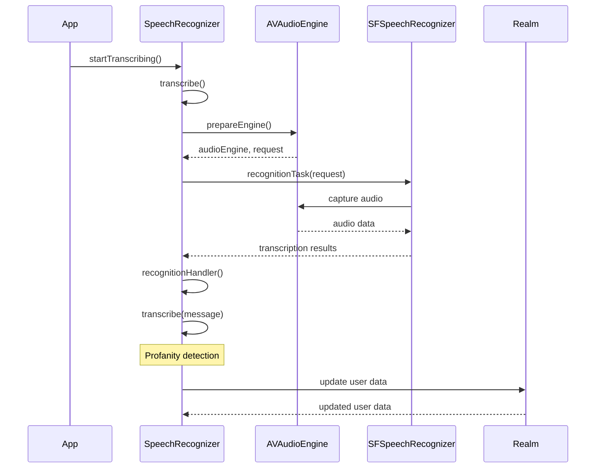

<details>
<summary>Relevant source files</summary>

The following files were used as context for generating this wiki page:

- [Scrumdinger/Models/SpeechRecognizer.swift](https://github.com/agattani123/swear-jar/blob/main/Scrumdinger/Models/SpeechRecognizer.swift)

</details>

# Speech Recognition Integration

## Introduction

The "Speech Recognition Integration" feature in this project provides functionality for real-time speech-to-text transcription and profanity detection. It leverages Apple's SFSpeechRecognizer and AVAudioEngine frameworks to capture audio from the device's microphone, transcribe the speech into text, and analyze the transcribed text for profane or inappropriate words. The feature is designed to work seamlessly with the project's data model, which stores user information, profanity word lists, and profanity usage statistics.

## Architecture Overview

The `SpeechRecognizer` class is the central component of the speech recognition integration. It is an `ObservableObject` that manages the entire speech recognition process, including audio capture, transcription, and profanity detection. The class follows the actor model, ensuring thread-safe access to its properties and methods.



Sources: [Scrumdinger/Models/SpeechRecognizer.swift](https://github.com/agattani123/swear-jar/blob/main/Scrumdinger/Models/SpeechRecognizer.swift)

## Speech Recognition Process

The speech recognition process follows these steps:

1. **Initialization**: The `SpeechRecognizer` initializer requests permission to access the speech recognizer and microphone. It also retrieves the user's profanity word list and previous profanity score from the Realm database.

2. **Audio Capture**: When `startTranscribing()` is called, the `transcribe()` method sets up an `AVAudioEngine` and `SFSpeechAudioBufferRecognitionRequest` to capture audio from the microphone.

3. **Speech Recognition**: The captured audio is passed to the `SFSpeechRecognizer`, which transcribes the speech into text. The transcription results are handled by the `recognitionHandler()` method.

4. **Profanity Detection**: As the transcribed text is received, the `transcribe(message:)` method analyzes it for profane words by comparing it against the user's profanity word list. If any profane words are found, the profanity count is incremented, and the device vibrates as a notification.

5. **Data Persistence**: After profanity detection, the user's profanity usage statistics (frequency map and total score) are updated in the Realm database.



Sources: [Scrumdinger/Models/SpeechRecognizer.swift](https://github.com/agattani123/swear-jar/blob/main/Scrumdinger/Models/SpeechRecognizer.swift)

## Key Components

| Component | Description |
| --- | --- |
| `SpeechRecognizer` | The main class that manages the speech recognition process, including audio capture, transcription, and profanity detection. |
| `AVAudioEngine` | Handles audio capture from the device's microphone. |
| `SFSpeechRecognizer` | Performs speech-to-text transcription on the captured audio data. |
| `Realm` | The database used to store user information, profanity word lists, and profanity usage statistics. |
| `UserInfo` | The data model representing a user's information, including their profanity word list and profanity usage statistics. |

Sources: [Scrumdinger/Models/SpeechRecognizer.swift](https://github.com/agattani123/swear-jar/blob/main/Scrumdinger/Models/SpeechRecognizer.swift)

## Error Handling

The `SpeechRecognizer` class defines a `RecognizerError` enum to handle various error cases that may occur during the speech recognition process. These errors include:

- `nilRecognizer`: Unable to initialize the speech recognizer.
- `notAuthorizedToRecognize`: The app is not authorized to access the speech recognizer.
- `notPermittedToRecord`: The app is not permitted to record audio.
- `recognizerIsUnavailable`: The speech recognizer is unavailable.

When an error occurs, the `transcribe(error:)` method is called, and the error message is displayed in the `transcript` property.

```swift
nonisolated private func transcribe(_ error: Error) {
    var errorMessage = ""
    if let error = error as? RecognizerError {
        errorMessage += error.message
    } else {
        errorMessage += error.localizedDescription
    }
    Task { @MainActor [errorMessage] in
        transcript = "<< \(errorMessage) >>"
    }
}
```

Sources: [Scrumdinger/Models/SpeechRecognizer.swift:60-71](https://github.com/agattani123/swear-jar/blob/main/Scrumdinger/Models/SpeechRecognizer.swift#L60-L71)

## Conclusion

The "Speech Recognition Integration" feature provides a robust and efficient way to transcribe speech into text and detect profane words in real-time. It seamlessly integrates with the project's data model, allowing for the storage and retrieval of user-specific profanity word lists and profanity usage statistics. The feature leverages Apple's speech recognition and audio capture frameworks, ensuring a smooth and reliable user experience.