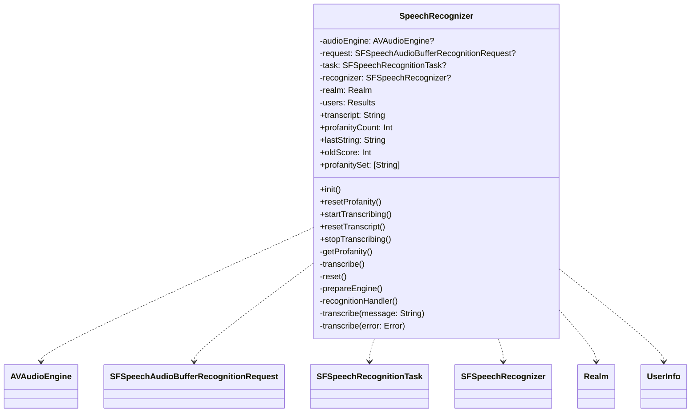
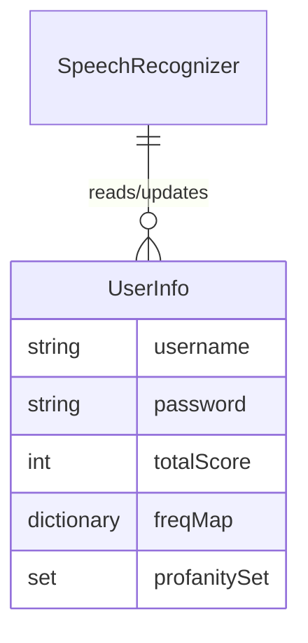
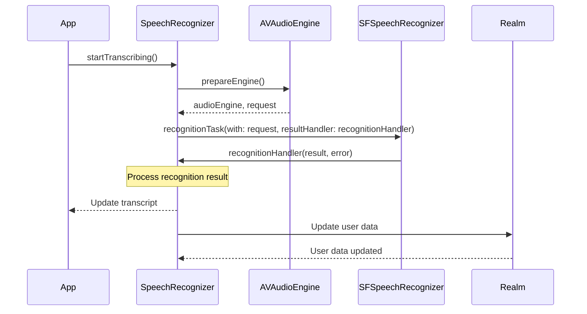

<details>
<summary>Relevant source files</summary>

The following files were used as context for generating this wiki page:

- [Scrumdinger/Models/SpeechRecognizer.swift](https://github.com/agattani123/swear-jar/blob/main/Scrumdinger/Models/SpeechRecognizer.swift)

</details>

# Speech Recognition Integration

## Introduction

The Speech Recognition Integration feature in this project provides functionality for transcribing speech to text using the `SFSpeechRecognizer` and `AVAudioEngine` classes from the AVFoundation and Speech frameworks in SwiftUI. It allows users to start and stop transcribing audio, and it handles the recognition process, including error handling and permissions. Additionally, it integrates with the Realm database to store and update user information related to profanity tracking.

Sources: [Scrumdinger/Models/SpeechRecognizer.swift](https://github.com/agattani123/swear-jar/blob/main/Scrumdinger/Models/SpeechRecognizer.swift)

## Architecture and Components

### SpeechRecognizer Actor

The `SpeechRecognizer` is an actor class that manages the speech recognition process. It conforms to the `ObservableObject` protocol, allowing its properties to be observed and updated in SwiftUI views.



Sources: [Scrumdinger/Models/SpeechRecognizer.swift:18-266](https://github.com/agattani123/swear-jar/blob/main/Scrumdinger/Models/SpeechRecognizer.swift#L18-L266)

### Data Flow

The speech recognition process follows this flow:

```mermaid
graph TD
    A[Start Transcribing] -->|1. startTranscribing()| B[Prepare Audio Engine]
    B -->|2. prepareEngine()| C[Create Recognition Request]
    C -->|3. recognitionTask()| D[Speech Recognition Task]
    D -->|4. recognitionHandler()| E[Process Recognition Result]
    E -->|5. transcribe(message)| F[Update Transcript]
    F -->|6. Update Realm Database| G[Store User Data]
```

1. The `startTranscribing()` method is called to initiate the speech recognition process.
2. The `prepareEngine()` method sets up the `AVAudioEngine` and creates a `SFSpeechAudioBufferRecognitionRequest`.
3. A `SFSpeechRecognitionTask` is created using the `recognitionTask(with:resultHandler:)` method of `SFSpeechRecognizer`.
4. The `recognitionHandler(audioEngine:result:error:)` method is called when a recognition result or error is received.
5. The `transcribe(message:)` method updates the `transcript` property with the recognized text and handles profanity detection.
6. User data, including profanity counts and frequencies, are updated in the Realm database.

Sources: [Scrumdinger/Models/SpeechRecognizer.swift:18-266](https://github.com/agattani123/swear-jar/blob/main/Scrumdinger/Models/SpeechRecognizer.swift#L18-L266)

### Profanity Tracking

The `SpeechRecognizer` class integrates with the Realm database to store and update user information related to profanity tracking. It maintains a list of profanity words (`profanitySet`) and keeps track of the profanity count and frequency for each user.



When a profanity word is detected in the transcribed text, the following actions are taken:

1. The `profanityCount` property is incremented.
2. The device vibrates using `UIDevice.vibrate()`.
3. The user's `freqMap` dictionary in the Realm database is updated with the frequency of the profanity word.
4. The user's `totalScore` is recalculated based on the updated `freqMap`.

Sources: [Scrumdinger/Models/SpeechRecognizer.swift:18-266](https://github.com/agattani123/swear-jar/blob/main/Scrumdinger/Models/SpeechRecognizer.swift#L18-L266)

## Error Handling

The `SpeechRecognizer` class defines a `RecognizerError` enum to handle various error cases that may occur during the speech recognition process.

| Error Case | Description |
| --- | --- |
| `.nilRecognizer` | Unable to initialize the speech recognizer. |
| `.notAuthorizedToRecognize` | Not authorized to recognize speech. |
| `.notPermittedToRecord` | Not permitted to record audio. |
| `.recognizerIsUnavailable` | The speech recognizer is unavailable. |

When an error occurs, the `transcribe(error:)` method is called, and the `transcript` property is updated with an error message.

Sources: [Scrumdinger/Models/SpeechRecognizer.swift:7-16](https://github.com/agattani123/swear-jar/blob/main/Scrumdinger/Models/SpeechRecognizer.swift#L7-L16), [Scrumdinger/Models/SpeechRecognizer.swift:235-244](https://github.com/agattani123/swear-jar/blob/main/Scrumdinger/Models/SpeechRecognizer.swift#L235-L244)

## Sequence Diagram

Here's a sequence diagram illustrating the interaction between the components involved in the speech recognition process:



1. The app calls `startTranscribing()` on the `SpeechRecognizer` instance.
2. The `SpeechRecognizer` prepares the `AVAudioEngine` and creates a recognition request.
3. A `SFSpeechRecognitionTask` is created using the `SFSpeechRecognizer`.
4. The `SFSpeechRecognizer` calls the `recognitionHandler` on the `SpeechRecognizer` with recognition results or errors.
5. The `SpeechRecognizer` processes the recognition result, updates the `transcript` property, and notifies the app.
6. The `SpeechRecognizer` updates the user data in the Realm database.

Sources: [Scrumdinger/Models/SpeechRecognizer.swift:18-266](https://github.com/agattani123/swear-jar/blob/main/Scrumdinger/Models/SpeechRecognizer.swift#L18-L266)

## Conclusion

The Speech Recognition Integration feature provides a robust and efficient way to transcribe speech to text within the project. It leverages the `SFSpeechRecognizer` and `AVAudioEngine` classes to handle the recognition process, and it integrates with the Realm database to store and update user information related to profanity tracking. The feature includes error handling, permissions handling, and profanity detection with device vibration feedback. Overall, this feature enhances the user experience by allowing users to interact with the app using voice commands and providing real-time transcription and profanity tracking.