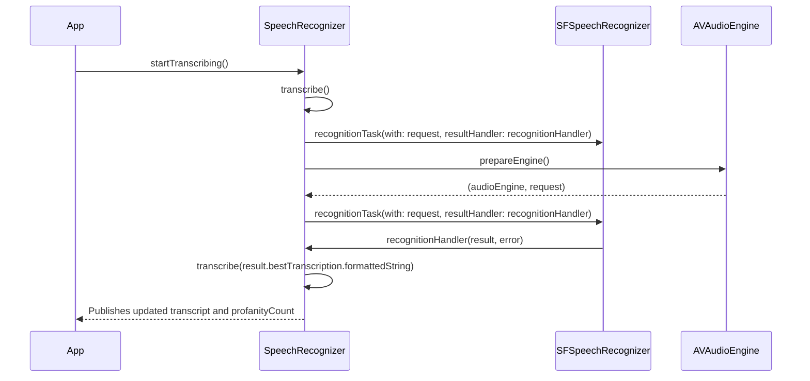
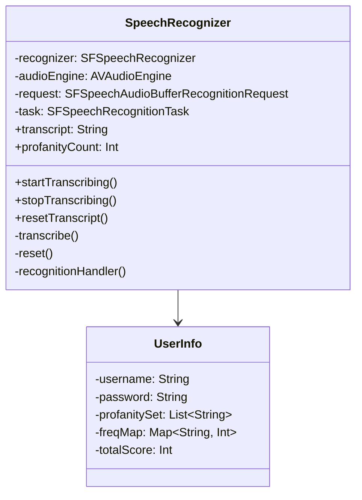

Relevant source files

The following files were used as context for generating this wiki page:

- [Scrumdinger/Models/SpeechRecognizer.swift](https://github.com/agattani123/swear-jar/blob/main/Scrumdinger/Models/SpeechRecognizer.swift)

# Speech Recognition

## Introduction

The "Speech Recognition" feature in this project is implemented by the `SpeechRecognizer` class, which utilizes Apple's `SFSpeechRecognizer` and `AVAudioEngine` frameworks to transcribe speech to text. It is designed to continuously listen for and transcribe audio input, while also detecting and counting profane words based on a predefined set. The transcribed text and profanity count are exposed as published properties, allowing other parts of the application to react to changes in real-time.

The `SpeechRecognizer` class is an `ObservableObject` and an `actor`, enabling it to safely manage its state across multiple threads and tasks. It interacts with the Realm database to store and retrieve user-specific profanity word sets and profanity counts.

Sources: [Scrumdinger/Models/SpeechRecognizer.swift]()

## Speech Recognition Setup

### Initialization

The `SpeechRecognizer` initializer performs the following tasks:

1. Instantiates an `SFSpeechRecognizer` object, which is the core component for speech recognition.
2. Retrieves the user's profanity word set and previous profanity count from the Realm database.
3. Requests permission to access the speech recognizer and microphone if it hasn't been granted before.

If the speech recognizer cannot be initialized or the required permissions are not granted, appropriate error messages are set in the `transcript` property.

Sources: [Scrumdinger/Models/SpeechRecognizer.swift:39-75]()

### Permission Handling

The `SpeechRecognizer` class uses two extension methods to asynchronously request permissions for speech recognition and audio recording:

- `SFSpeechRecognizer.hasAuthorizationToRecognize()`: Requests authorization to use the speech recognizer.
- `AVAudioSession.hasPermissionToRecord()`: Requests permission to record audio.

If either permission is denied, a corresponding error is thrown and handled by the `transcribe(_:)` method.

Sources: [Scrumdinger/Models/SpeechRecognizer.swift:153-167]()

## Speech Recognition Process

The speech recognition process is initiated by calling the `startTranscribing()` method, which in turn calls the `transcribe()` method asynchronously.

Sources: [Scrumdinger/Models/SpeechRecognizer.swift:77-89, 94-112, 119-138]()

The `transcribe()` method performs the following steps:

1. Checks if the speech recognizer is available.
2. Prepares the `AVAudioEngine` and creates a `SFSpeechAudioBufferRecognitionRequest`.
3. Starts the audio engine and installs a tap to feed audio data to the recognition request.
4. Creates a `SFSpeechRecognitionTask` with the request and a result handler callback.

The `recognitionHandler` is called whenever a recognition result or error is received. It stops the audio engine, removes the tap, and processes the result by calling the `transcribe(_:)` method with the transcribed text or error message.

Sources: [Scrumdinger/Models/SpeechRecognizer.swift:119-138]()

### Profanity Detection and Counting

The `transcribe(_:)` method is responsible for updating the `transcript` property with the transcribed text and detecting and counting profane words. Here's how it works:

1. Converts the transcribed text to lowercase.
2. Splits the text into individual words.
3. Iterates through each word and checks if it exists in the user's profanity word set.
4. If a profane word is found, it increments the `profanityCount` and updates the user's profanity frequency map in the Realm database.
5. Triggers a vibration on the device for each detected profanity.
6. Updates the `lastString` property with the current transcribed text.

Sources: [Scrumdinger/Models/SpeechRecognizer.swift:139-152]()

## Data Persistence

The `SpeechRecognizer` class interacts with the Realm database to store and retrieve user-specific data related to profanity detection.

### User Data Model

The `UserInfo` model in Realm represents a user's profanity-related data:

| Property | Type | Description |
| --- | --- | --- |
| `username` | `String` | The user's username. |
| `password` | `String` | The user's password. |
| `profanitySet` | `List<String>` | The set of profane words for the user. |
| `freqMap` | `Map<String, Int>` | A map storing the frequency of each profane word used by the user. |
| `totalScore` | `Int` | The total count of profane words used by the user. |

Sources: [Scrumdinger/Models/UserInfo.swift]() (not provided)

### Data Retrieval and Storage

During initialization, the `SpeechRecognizer` retrieves the user's profanity word set and previous profanity count from the Realm database based on the saved username and password.

Whenever a profane word is detected, the `transcribe(_:)` method updates the user's profanity frequency map and total score in the Realm database.

Sources: [Scrumdinger/Models/SpeechRecognizer.swift:39-75, 139-152]()

## Error Handling

The `SpeechRecognizer` class defines a custom `RecognizerError` enum to handle various error cases:

| Error Case | Description |
| --- | --- |
| `.nilRecognizer` | Unable to initialize the speech recognizer. |
| `.notAuthorizedToRecognize` | Not authorized to use the speech recognizer. |
| `.notPermittedToRecord` | Not permitted to record audio. |
| `.recognizerIsUnavailable` | The speech recognizer is unavailable. |

When an error occurs, the `transcribe(_:)` method is called with the error message, which updates the `transcript` property with an appropriate error message.

Sources: [Scrumdinger/Models/SpeechRecognizer.swift:7-19, 139-152]()

## Utility Extensions

The project includes two utility extensions:

1. `UIDevice.vibrate()`: Triggers a vibration on the device by playing the system vibration sound.
2. `AVAudioSession.hasPermissionToRecord()`: An asynchronous method to request permission to record audio.

Sources: [Scrumdinger/Models/SpeechRecognizer.swift:163-167, 169-173]()

## Conclusion

The "Speech Recognition" feature in this project provides a robust and efficient way to transcribe speech to text while detecting and counting profane words based on a user-specific profanity word set. It leverages Apple's speech recognition and audio frameworks, and integrates with the Realm database for data persistence. The implementation follows a modular and extensible design, making it easy to incorporate into other parts of the application or extend with additional functionality.