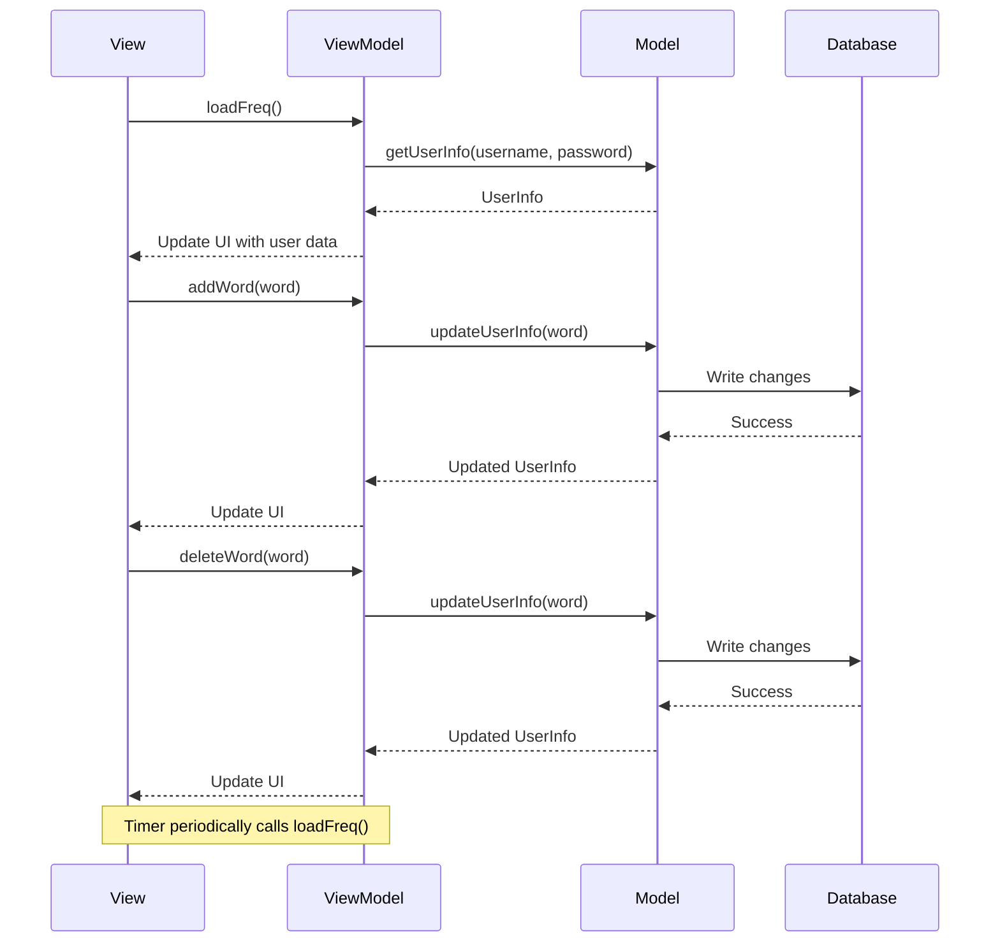
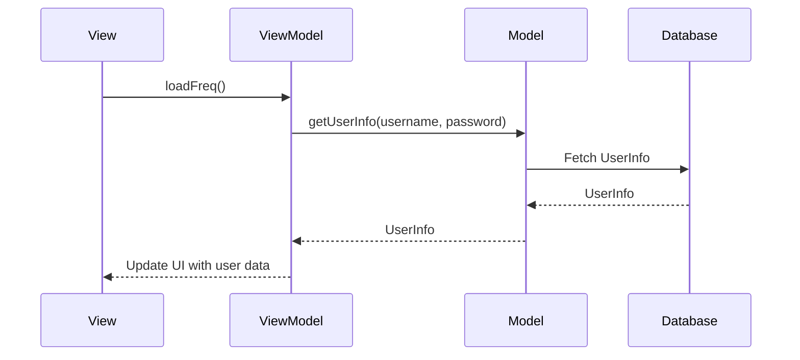
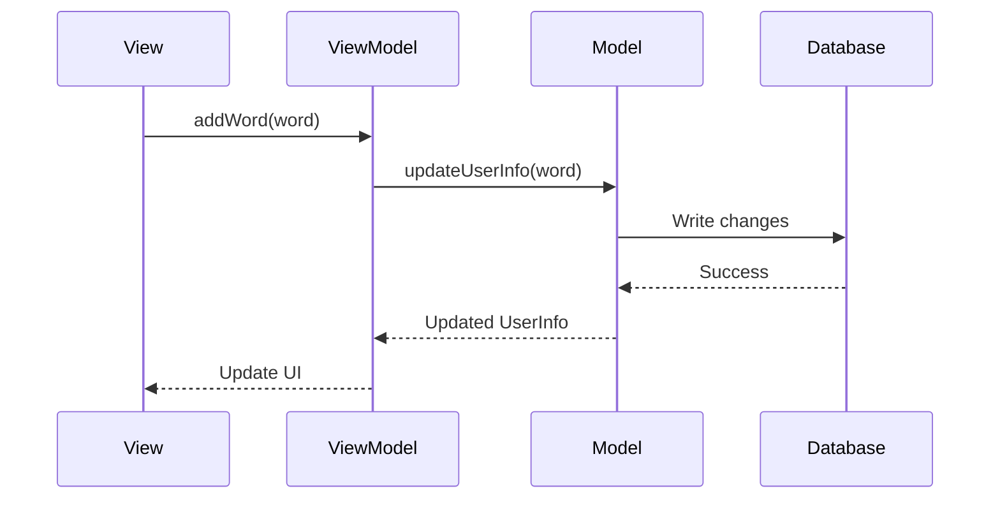
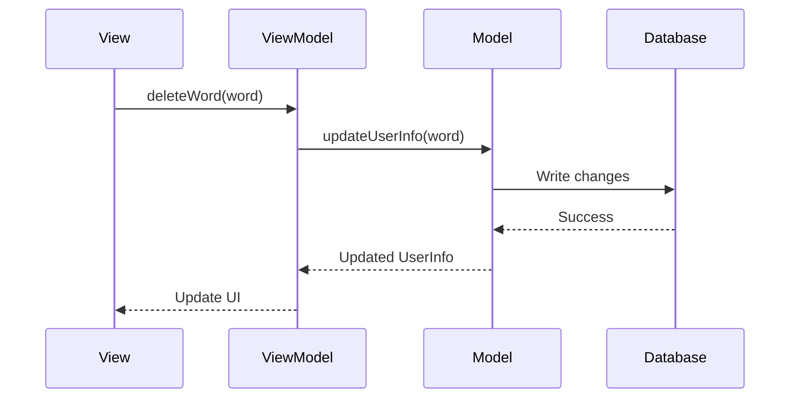

Relevant source files

The following files were used as context for generating this wiki page:

- [Scrumdinger/Views/AnalyticsView.swift](https://github.com/agattani123/swear-jar/blob/main/Scrumdinger/Views/AnalyticsView.swift)

# Analytics and Reporting

## Introduction

The `AnalyticsView` in the Scrumdinger project provides a user interface for tracking and managing profanity usage. It allows users to add or delete words to a profanity set, displays a frequency counter for the tracked words, and shows a progress bar indicating the user's total profanity score relative to a target limit. This view integrates with the Realm database to persist and retrieve user-specific data.

## Architecture and Data Flow

The `AnalyticsView` follows the Model-View-ViewModel (MVVM) architectural pattern, where the view is responsible for presenting the user interface and handling user interactions, while the data and business logic are separated into other components.

### Data Model

The `UserInfo` class, which is likely defined in a separate file, represents the user's data model. It contains the following properties:

- `profanitySet`: A set of strings representing the profanity words tracked for the user.
- `freqMap`: A dictionary that maps each profanity word (string) to its frequency count (integer).
- `totalScore`: An integer representing the user's total profanity score, calculated as the sum of frequencies for all tracked words.

This data model is persisted using the Realm database, which is initialized in the `AnalyticsView` struct.

### View Components

The `AnalyticsView` struct contains the following main components:

1. **State Variables**: Various `@State` properties to hold the view's mutable state, such as the list of words, frequencies, tuples (word-frequency pairs), the current word being edited, and other UI-related states.

2. **User Interface Elements**: SwiftUI views representing the UI components, including a `TextField` for adding/deleting words, buttons for adding and deleting words, a `ProgressView` for displaying the user's profanity score progress, and a list of word-frequency pairs.

3. **Data Loading and Persistence**: Functions to load and persist user data from/to the Realm database, including `loadFreq()`, `addWord(word:)`, and `deleteWord(word:)`.

4. **Timer**: A timer that periodically calls the `loadFreq()` function to update the view with the latest data from the Realm database.

### Data Flow

The data flow in the `AnalyticsView` can be summarized as follows:

1. When the view appears (`onAppear`), it loads the user's profanity data from the Realm database by calling `loadFreq()`.
2. The `loadFreq()` function retrieves the `UserInfo` object from Realm based on the user's credentials (username and password), and populates the `tuples` array with word-frequency pairs from the `freqMap` dictionary. It also updates the `totalCount` property with the user's total profanity score.
3. The user can add or delete words using the `TextField` and the respective buttons, which call the `addWord(word:)` or `deleteWord(word:)` functions.
4. These functions update the `UserInfo` object in the Realm database by modifying the `profanitySet`, `freqMap`, and `totalScore` properties accordingly.
5. The timer periodically calls `loadFreq()` to refresh the view with the latest data from the Realm database.

Sources: [Scrumdinger/Views/AnalyticsView.swift](https://github.com/agattani123/swear-jar/blob/main/Scrumdinger/Views/AnalyticsView.swift)

## Key Components

### AnalyticsView

The `AnalyticsView` struct is the main view component responsible for displaying the user interface and handling user interactions. It contains the following key properties and methods:

| Property/Method | Description |
| --- | --- |
| `words` | A state variable holding the list of words. |
| `frequencies` | A state variable holding the frequencies of the words. |
| `tuples` | A state variable holding the word-frequency pairs as tuples. |
| `word` | A state variable representing the current word being edited. |
| `incorrectInfo` | A state variable indicating if the current word is invalid. |
| `totalCount` | A state variable representing the user's total profanity score. |
| `frequency` | A computed property determining the frequency at which the data is refreshed. |
| `realm` | An instance of the Realm database. |
| `body` | The SwiftUI view hierarchy representing the user interface. |
| `startTimer()` | A method that starts a timer to periodically refresh the data. |
| `loadFreq()` | A method that loads the user's profanity data from the Realm database. |
| `addWord(word:)` | A method that adds a new word to the user's profanity set and updates the Realm database. |
| `deleteWord(word:)` | A method that removes a word from the user's profanity set and updates the Realm database. |

Sources: [Scrumdinger/Views/AnalyticsView.swift](https://github.com/agattani123/swear-jar/blob/main/Scrumdinger/Views/AnalyticsView.swift)

### UserInfo

The `UserInfo` class likely represents the user's data model, although its definition is not provided in the given source file. Based on the usage in `AnalyticsView`, it appears to have the following properties:

| Property | Type | Description |
| --- | --- | --- |
| `profanitySet` | Set<String> | A set of strings representing the profanity words tracked for the user. |
| `freqMap` | [String: Int] | A dictionary that maps each profanity word (string) to its frequency count (integer). |
| `totalScore` | Int | An integer representing the user's total profanity score, calculated as the sum of frequencies for all tracked words. |

Sources: [Scrumdinger/Views/AnalyticsView.swift](https://github.com/agattani123/swear-jar/blob/main/Scrumdinger/Views/AnalyticsView.swift)

## Sequence Diagrams

### Loading User Data

1. The `AnalyticsView` calls the `loadFreq()` method in the view model.
2. The view model retrieves the user's credentials (username and password) and calls the `getUserInfo` method in the model.
3. The model fetches the `UserInfo` object from the Realm database based on the provided credentials.
4. The database returns the `UserInfo` object to the model.
5. The model passes the `UserInfo` object to the view model.
6. The view model updates the view's state with the user's profanity data (word-frequency pairs and total score).

Sources: [Scrumdinger/Views/AnalyticsView.swift](https://github.com/agattani123/swear-jar/blob/main/Scrumdinger/Views/AnalyticsView.swift)

### Adding a Word

1. The user enters a new word in the `TextField` and clicks the "Add" button, triggering the `addWord(word:)` method in the view model.
2. The view model calls the `updateUserInfo(word)` method in the model, passing the new word.
3. The model updates the `UserInfo` object by adding the new word to the `profanitySet` and initializing its frequency in the `freqMap`.
4. The model writes the changes to the Realm database.
5. The database confirms the successful write operation.
6. The model passes the updated `UserInfo` object to the view model.
7. The view model updates the view's state with the new word-frequency pair and the updated total score.

Sources: [Scrumdinger/Views/AnalyticsView.swift](https://github.com/agattani123/swear-jar/blob/main/Scrumdinger/Views/AnalyticsView.swift)

### Deleting a Word

1. The user enters a word in the `TextField` and clicks the "Delete" button, triggering the `deleteWord(word:)` method in the view model.
2. The view model calls the `updateUserInfo(word)` method in the model, passing the word to be deleted.
3. The model removes the word from the `profanitySet`, removes its entry from the `freqMap`, and recalculates the `totalScore`.
4. The model writes the changes to the Realm database.
5. The database confirms the successful write operation.
6. The model passes the updated `UserInfo` object to the view model.
7. The view model updates the view's state with the updated word-frequency pairs and the new total score.

Sources: [Scrumdinger/Views/AnalyticsView.swift](https://github.com/agattani123/swear-jar/blob/main/Scrumdinger/Views/AnalyticsView.swift)

## Conclusion

The `AnalyticsView` in the Scrumdinger project provides a user interface for tracking and managing profanity usage. It allows users to add or delete words to a profanity set, displays a frequency counter for the tracked words, and shows a progress bar indicating the user's total profanity score relative to a target limit. The view integrates with the Realm database to persist and retrieve user-specific data, following the MVVM architectural pattern to separate concerns and promote code reusability and maintainability.