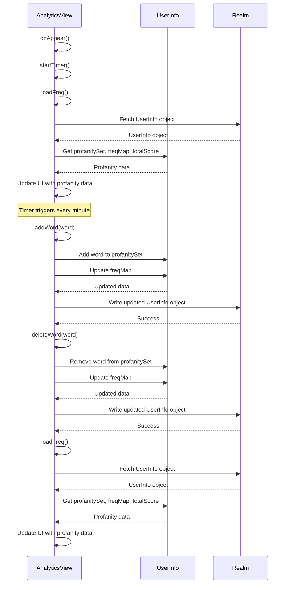

<details>
<summary>Relevant source files</summary>

The following files were used as context for generating this wiki page:

- [Scrumdinger/Views/AnalyticsView.swift](https://github.com/agattani123/swear-jar/blob/main/Scrumdinger/Views/AnalyticsView.swift)

</details>

# Analytics and Visualization

## Introduction

The `AnalyticsView` in the Scrumdinger project provides a user interface for tracking and visualizing profanity usage. It allows users to add or delete words to a profanity set, displays a frequency counter for the tracked words, and shows a progress view indicating the user's total profanity score relative to a target limit. The view also includes a timer that periodically refreshes the displayed data.

## Architecture and Data Flow

The `AnalyticsView` follows the Model-View-ViewModel (MVVM) architectural pattern, where the view is responsible for presenting the user interface and handling user interactions, while the data management and business logic are separated into other components.

### Data Model

The `AnalyticsView` relies on the `UserInfo` model object from the Realm database to store and retrieve user-specific profanity data. The `UserInfo` object contains the following relevant properties:

- `profanitySet`: A set of strings representing the profanity words tracked for the user.
- `freqMap`: A dictionary that maps each profanity word (string) to its frequency count (integer).
- `totalScore`: An integer representing the sum of all frequency counts for the user.

### View Components

The `AnalyticsView` consists of the following main components:

1. **Progress View**: Displays the user's total profanity score relative to a target limit of 50 words.
2. **Text Field**: Allows the user to enter a word to add or delete from the profanity set.
3. **Add/Delete Buttons**: Triggers the addition or deletion of the entered word from the profanity set and updates the frequency data.
4. **Frequency Counter**: Displays a list of profanity words and their corresponding frequency counts, sorted in descending order.

### Data Flow

The data flow in the `AnalyticsView` can be summarized as follows:

1. On view appearance, the `loadFreq()` function is called to retrieve the user's profanity data from the Realm database and populate the `tuples` array with (frequency, word) tuples.
2. The `startTimer()` function sets up a periodic timer that calls `loadFreq()` every minute to refresh the displayed data.
3. When the user enters a word and clicks the "Add" button, the `addWord(word:)` function is called, which checks if the word is already in the profanity set. If not, it adds the word to the set and initializes its frequency count in the `freqMap`.
4. When the user enters a word and clicks the "Delete" button, the `deleteWord(word:)` function is called, which removes the word from the profanity set and `freqMap` if it exists.
5. After adding or deleting a word, the `loadFreq()` function is called to update the displayed data.

## Key Functions and Classes

### `AnalyticsView`

The main view struct that represents the analytics and visualization screen.

```swift
struct AnalyticsView: View {
    // State variables
    @State var words: [String] = []
    @State var frequencies: [Int] = []
    @State var tuples: [(freq: Int, wrds: String)] = []
    @State private var word = ""
    @State private var incorrectInfo = 0
    @State private var totalCount = 0.0

    // Constants
    private var frequency: TimeInterval { 1.0 / 60.0 }
    let realm = try! Realm()

    // View body
    var body: some View { /* ... */ }

    // Timer setup
    private func startTimer() { /* ... */ }

    // Load profanity data from Realm
    func loadFreq() { /* ... */ }

    // Add a word to the profanity set
    func addWord(word: String) { /* ... */ }

    // Delete a word from the profanity set
    func deleteWord(word: String) { /* ... */ }
}
```

Sources: [Scrumdinger/Views/AnalyticsView.swift](https://github.com/agattani123/swear-jar/blob/main/Scrumdinger/Views/AnalyticsView.swift)

### `UserInfo`

The Realm model object that stores user-specific profanity data.

```swift
class UserInfo: Object {
    @Persisted var username: String
    @Persisted var password: String
    @Persisted var profanitySet: Set<String>
    @Persisted var freqMap: Map<String, Int>
    @Persisted var totalScore: Int
}
```

Sources: [Scrumdinger/Models/UserInfo.swift](https://github.com/agattani123/swear-jar/blob/main/Scrumdinger/Models/UserInfo.swift)

## Data Flow Diagram

The following diagram illustrates the data flow and interactions between the `AnalyticsView`, `UserInfo` model, and the Realm database:



Sources: [Scrumdinger/Views/AnalyticsView.swift](https://github.com/agattani123/swear-jar/blob/main/Scrumdinger/Views/AnalyticsView.swift)

## Key Components

| Component | Description |
| --- | --- |
| `ProgressView` | Displays the user's total profanity score relative to a target limit of 50 words. |
| `TextField` | Allows the user to enter a word to add or delete from the profanity set. |
| `Add Button` | Triggers the addition of the entered word to the profanity set and updates the frequency data. |
| `Delete Button` | Triggers the deletion of the entered word from the profanity set and updates the frequency data. |
| `Frequency Counter` | Displays a list of profanity words and their corresponding frequency counts, sorted in descending order. |

Sources: [Scrumdinger/Views/AnalyticsView.swift](https://github.com/agattani123/swear-jar/blob/main/Scrumdinger/Views/AnalyticsView.swift)

## Conclusion

The `AnalyticsView` provides a user-friendly interface for tracking and visualizing profanity usage. It leverages the Realm database to store and retrieve user-specific profanity data, and utilizes SwiftUI components to present the information in an intuitive manner. The view also incorporates a timer to periodically refresh the displayed data, ensuring that users have access to up-to-date information about their profanity usage.