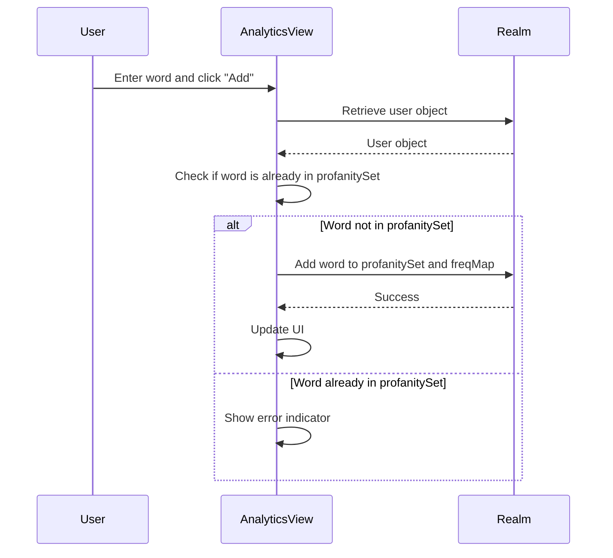
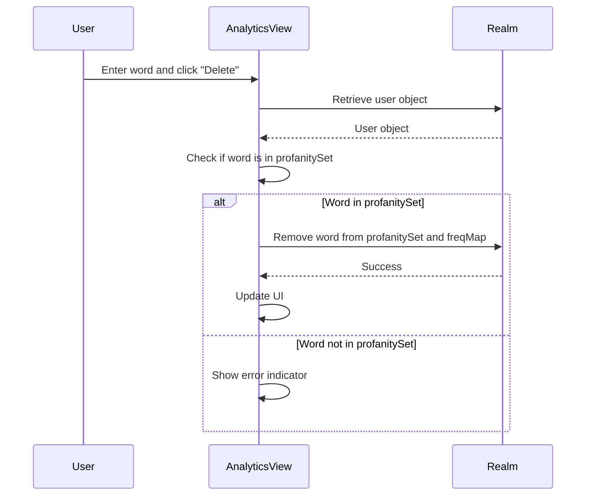

Relevant source files

The following files were used as context for generating this wiki page:

- [Scrumdinger/Views/AnalyticsView.swift](https://github.com/agattani123/swear-jar/blob/main/Scrumdinger/Views/AnalyticsView.swift)

# Analytics and Visualization

## Introduction

The `AnalyticsView` is a SwiftUI view responsible for displaying and managing profanity usage analytics for the logged-in user. It provides a visual representation of the user's profanity word frequency, along with functionality to add or delete words from the profanity list. The view also includes a progress indicator to track the user's total profanity score against a target threshold.

## User Interface

The `AnalyticsView` consists of the following UI components:

1. **Progress View:** Displays the user's total profanity score as a progress bar, with a target of 50 words.
2. **Text Field:** Allows the user to enter a word to add or delete from the profanity list.
3. **Add and Delete Buttons:** Buttons to add or delete the entered word from the profanity list.
4. **Frequency Counter:** A list displaying the frequency of each profanity word used by the user.

Sources: [Scrumdinger/Views/AnalyticsView.swift:24-61]()

## Data Management

The `AnalyticsView` relies on the `UserInfo` model object from the Realm database to store and retrieve the user's profanity data. The relevant properties and methods used are:

- `profanitySet`: A set containing all the profanity words for the user.
- `freqMap`: A dictionary mapping profanity words to their respective frequencies.
- `totalScore`: The total count of profanity words used by the user.

Sources: [Scrumdinger/Views/AnalyticsView.swift:64-78, 80-103, 105-139]()

## View Lifecycle

The `AnalyticsView` performs the following operations during its lifecycle:

1. **onAppear():** When the view appears, it loads the user's profanity data from the Realm database and starts a timer to periodically refresh the data.
2. **startTimer():** Schedules a repeating timer that calls the `loadFreq()` function every minute to update the profanity data.
3. **loadFreq():** Retrieves the logged-in user's profanity data from the Realm database, updates the `tuples` array with the word-frequency pairs, and calculates the `totalCount` for the progress view.

Sources: [Scrumdinger/Views/AnalyticsView.swift:64-78]()

## Word Management

The `AnalyticsView` provides functionality to add or delete profanity words from the user's list:

### Add Word

The `addWord` function adds the entered word to the user's `profanitySet` and `freqMap` in the Realm database if it doesn't already exist. It also updates the UI accordingly.

Sources: [Scrumdinger/Views/AnalyticsView.swift:80-103]()

### Delete Word

The `deleteWord` function removes the entered word from the user's `profanitySet` and `freqMap` in the Realm database if it exists. It also resets the `totalScore` and updates the UI accordingly.

Sources: [Scrumdinger/Views/AnalyticsView.swift:105-139]()

## Conclusion

The `AnalyticsView` provides a user-friendly interface for managing and visualizing profanity usage data. It leverages the Realm database to store and retrieve the user's profanity word list and frequency information. The view also includes functionality to add or delete words from the list, with appropriate error handling and UI updates.