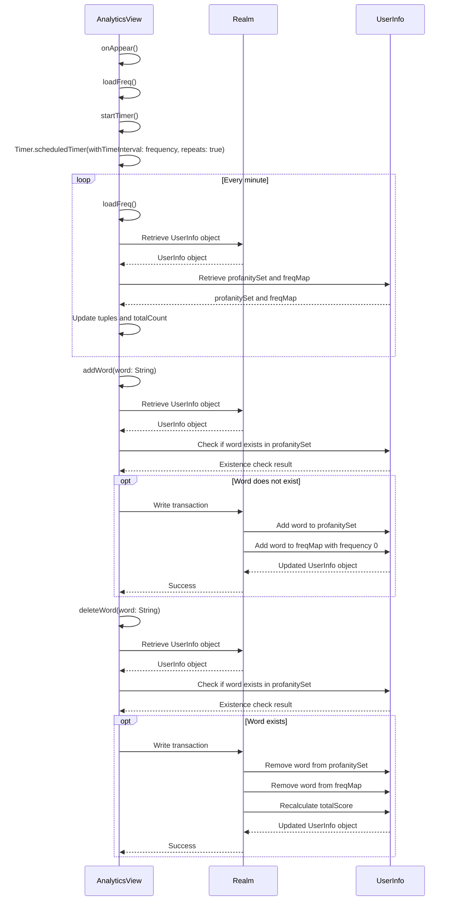

<details>
<summary>Relevant source files</summary>

The following files were used as context for generating this wiki page:

- [Scrumdinger/Views/AnalyticsView.swift](https://github.com/agattani123/swear-jar/blob/main/Scrumdinger/Views/AnalyticsView.swift)
</details>

# Analytics

## Introduction

The AnalyticsView is a SwiftUI view responsible for displaying and managing profanity usage statistics for the current user. It provides a user interface for adding and deleting profane words, visualizing the frequency of each word, and tracking the user's overall profanity score. This view integrates with the Realm database to persist and retrieve user-specific data.

## User Interface

The AnalyticsView's user interface consists of the following components:

### Progress View

A `ProgressView` displays the user's current profanity score relative to a target score of 50. This visual indicator helps users monitor their profanity usage.

```swift
ProgressView(value: totalCount, total: 50.0).frame(width: 250)
```

Source: [Scrumdinger/Views/AnalyticsView.swift:22]()

### Text Field

A `TextField` allows users to enter a word they want to add or delete from their profanity list.

```swift
TextField("Add or delete words", text: $word)
    .padding()
    .frame(width: 300, height: 50)
    .border(.black)
    .foregroundColor(.black)
    .cornerRadius(10)
    .border(.red, width: CGFloat(incorrectInfo))
```

Source: [Scrumdinger/Views/AnalyticsView.swift:27-31]()

### Add and Delete Buttons

Two buttons, "Add" and "Delete," enable users to add or remove words from their profanity list, respectively.

```swift
Button("Add") { addWord(word: word) }
    .foregroundColor(.white)
    .frame(width: 130, height: 50)
    .background(Color.blue.opacity(0.4))
    .cornerRadius(10)

Button("Delete") { deleteWord(word: word) }
    .foregroundColor(.white)
    .frame(width: 130, height: 50)
    .background(Color.blue.opacity(0.4))
    .cornerRadius(10)
```

Source: [Scrumdinger/Views/AnalyticsView.swift:33-42]()

### Frequency Counter

A `ForEach` loop displays a list of profane words and their respective frequencies, sorted in descending order by frequency.

```swift
ForEach(0...tuples.count, id: \.self) { idx in
    if (idx != tuples.count) {
        HStack(spacing: 10) {
            Text(tuples[idx].wrds)
            Text("\(tuples[idx].freq)")
        }
    }
}
```

Source: [Scrumdinger/Views/AnalyticsView.swift:46-52]()

## Data Management

The AnalyticsView interacts with the Realm database to store and retrieve user-specific profanity data. The `UserInfo` model object represents a user and contains the following properties:

- `profanitySet`: A set of strings representing the user's profane words.
- `freqMap`: A dictionary mapping profane words to their respective frequencies.
- `totalScore`: The user's overall profanity score, calculated as the sum of frequencies for all profane words.

### Loading Frequency Data

The `loadFreq()` function retrieves the current user's profanity data from the Realm database and populates the `tuples` array with tuples of `(frequency, word)`. It also updates the `totalCount` property with the user's total profanity score, capped at 50.

```swift
func loadFreq() {
    let savedUsername = UserDefaults.standard.object(forKey: "username") as? String ?? ""
    let savedPassword = UserDefaults.standard.object(forKey: "password") as? String ?? ""
    let users = realm.objects(UserInfo.self).where {
        $0.password == savedPassword && $0.username == savedUsername
    }
    if let user = users.first {
        tuples = []
        for key in user.freqMap.keys {
            if let num = user.freqMap[key] {
                tuples.append((num, key))
            }
        }
        totalCount = Double(min(user.totalScore, 50))
    }
    tuples.sort(by: { $0.freq > $1.freq })
}
```

Source: [Scrumdinger/Views/AnalyticsView.swift:60-74]()

### Adding a Word

The `addWord(word:)` function adds a new profane word to the user's profanity set and frequency map in the Realm database. If the word already exists in the profanity set, an error border is displayed around the text field.

```swift
func addWord(word: String) {
    let savedUsername = UserDefaults.standard.object(forKey: "username") as? String ?? ""
    let savedPassword = UserDefaults.standard.object(forKey: "password") as? String ?? ""
    let users = realm.objects(UserInfo.self).where {
        $0.password == savedPassword && $0.username == savedUsername
    }
    if let user = users.first {
        if user.profanitySet.contains(word.lowercased()) {
            incorrectInfo = 2
        } else {
            incorrectInfo = 0
            try! realm.write {
                user.profanitySet.append(word.lowercased())
                user.freqMap[word.lowercased()] = 0
            }
        }
    }
    self.loadFreq()
}
```

Source: [Scrumdinger/Views/AnalyticsView.swift:77-93]()

### Deleting a Word

The `deleteWord(word:)` function removes a profane word from the user's profanity set and frequency map in the Realm database. If the word does not exist in the profanity set, an error border is displayed around the text field. After deleting the word, the user's total profanity score is recalculated.

```swift
func deleteWord(word: String) {
    let savedUsername = UserDefaults.standard.object(forKey: "username") as? String ?? ""
    let savedPassword = UserDefaults.standard.object(forKey: "password") as? String ?? ""
    let users = realm.objects(UserInfo.self).where {
        $0.password == savedPassword && $0.username == savedUsername
    }
    if let user = users.first {
        if user.profanitySet.contains(word.lowercased()) {
            incorrectInfo = 0
            var profanityCopy: [String] = []
            for profanity in user.profanitySet {
                if profanity != word.lowercased() {
                    profanityCopy.append(profanity)
                }
            }
            try! realm.write {
                user.profanitySet.removeAll()
                for copy in profanityCopy {
                    user.profanitySet.append(copy)
                }
                user.freqMap[word.lowercased()] = nil
                user.totalScore = 0
                for key in user.freqMap.keys {
                    user.totalScore = user.totalScore + (user.freqMap[key] ?? 0)
                }
                print(user.freqMap)
            }
        } else {
            incorrectInfo = 2
        }
    }
    self.loadFreq()
}
```

Source: [Scrumdinger/Views/AnalyticsView.swift:96-125]()

## Initialization and Timer

The AnalyticsView initializes the user's profanity data and starts a timer to periodically refresh the frequency data.

```swift
var body: some View {
    ZStack {
        // ...
    }
    .onAppear() {
        self.loadFreq()
        self.startTimer()
    }
}

private func startTimer() {
    Timer.scheduledTimer(withTimeInterval: frequency, repeats: true) { _ in
        loadFreq()
    }
}
```

Sources: [Scrumdinger/Views/AnalyticsView.swift:18-19](), [Scrumdinger/Views/AnalyticsView.swift:128-132]()

The `startTimer()` function creates a repeating timer that calls the `loadFreq()` function at a specified frequency (once per minute by default).

## Sequence Diagram



This sequence diagram illustrates the interactions between the AnalyticsView, Realm database, and UserInfo model object. It shows the flow of data retrieval, update, and deletion operations for the user's profanity data.

Sources: [Scrumdinger/Views/AnalyticsView.swift]()

## Conclusion

The AnalyticsView provides a user interface for managing and visualizing profanity usage statistics. It integrates with the Realm database to persist and retrieve user-specific data, including the profanity set, frequency map, and total profanity score. The view also implements a timer to periodically refresh the frequency data. Overall, the AnalyticsView plays a crucial role in helping users monitor and control their profanity usage within the application.