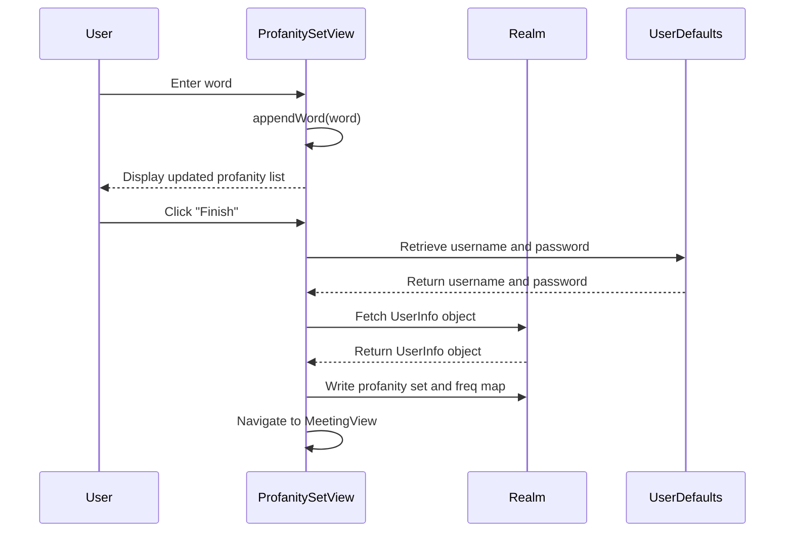

<details>
<summary>Relevant source files</summary>

The following file was used as context for generating this wiki page:

- [Scrumdinger/Views/ProfanitySetView.swift](https://github.com/agattani123/swear-jar/blob/main/Scrumdinger/Views/ProfanitySetView.swift)

</details>

# Word Management

## Introduction

The "Word Management" feature in the project allows users to create and maintain a set of profane or inappropriate words. This set is used to monitor and track the usage of these words within the application's context. The `ProfanitySetView` is the primary view responsible for managing this functionality.

## User Interface

The `ProfanitySetView` presents a user interface where users can input words and add them to a list of profanity words. The view consists of the following components:

1. **Word Input Field:** A `TextField` that allows users to enter a word they want to add to the profanity set.
2. **Add Button:** A button that, when clicked, adds the word entered in the input field to the profanity list, if it doesn't already exist.
3. **Finish Button:** A button that, when clicked, saves the profanity set to the user's profile and navigates to the `MeetingView`.
4. **Profanity List:** A `ForEach` view that displays the list of words currently in the profanity set.

Sources: [Scrumdinger/Views/ProfanitySetView.swift:16-49]()

## Data Management

The `ProfanitySetView` uses the following state variables to manage the profanity set:

- `profanityList: [String]`: An array that holds the list of profane words.
- `word: String`: A string that holds the word entered by the user in the input field.

Sources: [Scrumdinger/Views/ProfanitySetView.swift:10-12]()

## Word Addition

The `appendWord(word:)` function is responsible for adding a word to the `profanityList`. It checks if the word is already present in the list and, if not, appends the word (converted to lowercase) to the list.

```swift
func appendWord(word: String) {
    if (!profanityList.contains(word)) {
        profanityList.append(word.lowercased())
    }
}
```

Sources: [Scrumdinger/Views/ProfanitySetView.swift:58-62]()

## Saving Profanity Set

The `completeSignUp()` function is called when the user clicks the "Finish" button. It performs the following tasks:

1. Sets the `isFinished` state variable to `true`, which triggers the navigation to the `MeetingView`.
2. Retrieves the user's saved username and password from `UserDefaults`.
3. Fetches the `UserInfo` object from the Realm database based on the saved username and password.
4. If a `UserInfo` object is found, it writes the profanity set to the user's `profanitySet` property and initializes the `freqMap` (a dictionary that tracks the frequency of each profane word) with all words set to 0.

```swift
func completeSignUp() {
    isFinished = true
    let realm = try! Realm(configuration: configuration)
    let savedUsername = UserDefaults.standard.object(forKey: "username") as? String ?? ""
    let savedPassword = UserDefaults.standard.object(forKey: "password") as? String ?? ""
    let users = realm.objects(UserInfo.self).where{
        $0.password == savedPassword && $0.username == savedUsername
    }
    if let user = users.first {
        try! realm.write {
            for word in profanityList {
                user.profanitySet.append(word)
                user.freqMap[word] = 0
            }
        }
    }
}
```

Sources: [Scrumdinger/Views/ProfanitySetView.swift:64-80]()

## Data Flow

The data flow for the "Word Management" feature can be represented by the following sequence diagram:



This diagram illustrates the following flow:

1. The user enters a word in the input field, which triggers the `appendWord(word:)` function to add the word to the `profanityList`.
2. The updated profanity list is displayed to the user.
3. When the user clicks the "Finish" button, the `completeSignUp()` function is called.
4. The function retrieves the user's saved username and password from `UserDefaults`.
5. Using the username and password, the function fetches the `UserInfo` object from the Realm database.
6. If a `UserInfo` object is found, the function writes the profanity set and initializes the `freqMap` for the user.
7. Finally, the view navigates to the `MeetingView`.

Sources: [Scrumdinger/Views/ProfanitySetView.swift]()

## Summary

The "Word Management" feature in the project allows users to create and maintain a set of profane or inappropriate words. The `ProfanitySetView` provides a user interface for adding words to the profanity set and saving it to the user's profile in the Realm database. This feature is likely used in conjunction with other parts of the application to monitor and track the usage of profane words within the application's context.