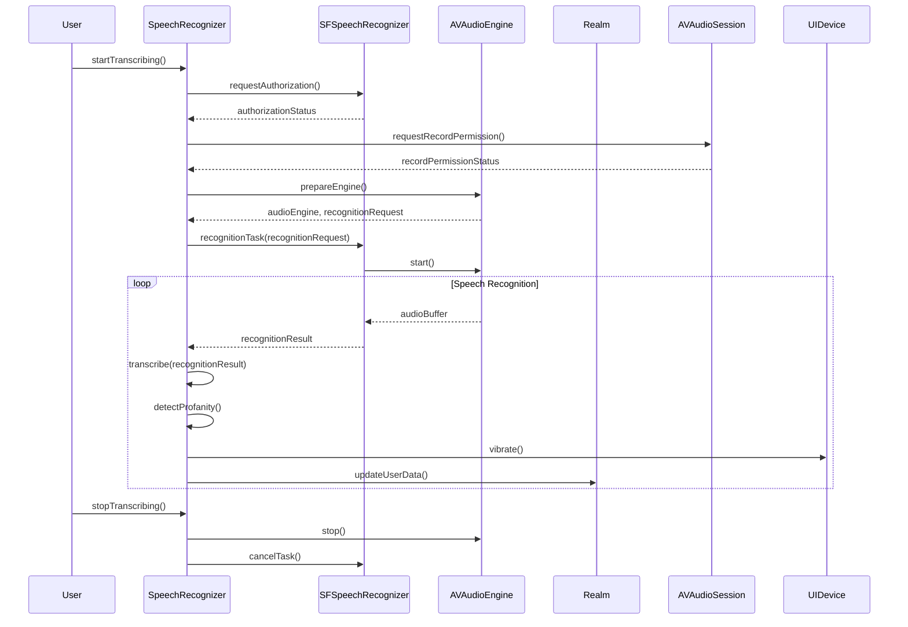

<details>
<summary>Relevant source files</summary>

The following file was used as context for generating this wiki page:

- [Scrumdinger/Models/SpeechRecognizer.swift](https://github.com/agattani123/swear-jar/blob/main/Scrumdinger/Models/SpeechRecognizer.swift)

</details>

# Word Tracking

## Introduction

The "Word Tracking" feature in this project is responsible for speech recognition and profanity detection. It utilizes the `SpeechRecognizer` class, which is an actor that transcribes speech to text using the `SFSpeechRecognizer` and `AVAudioEngine` frameworks. The transcribed text is then analyzed for profane words, and a count is maintained. Additionally, the feature keeps track of the frequency of profane words used by the user and calculates a score based on the usage.

This feature is likely part of a larger application that aims to discourage the use of profanity or inappropriate language, possibly through gamification or other incentives. The `SpeechRecognizer` class serves as the core component for enabling speech recognition and profanity tracking functionality.

Sources: [Scrumdinger/Models/SpeechRecognizer.swift]()

## Speech Recognition

### Initialization and Setup

The `SpeechRecognizer` class is initialized with an instance of `SFSpeechRecognizer`. During initialization, it requests authorization to recognize speech and permission to record audio from the user. If the recognizer is unavailable or the necessary permissions are not granted, appropriate error messages are displayed.

```swift
init() {
    recognizer = SFSpeechRecognizer()
    // ... (request authorization and permissions)
}
```

Sources: [Scrumdinger/Models/SpeechRecognizer.swift:37-60]()

### Transcription Process

The `transcribe()` function is responsible for starting the speech recognition process. It sets up the `AVAudioEngine` and creates a `SFSpeechRecognitionTask` with a `SFSpeechAudioBufferRecognitionRequest`. The `recognitionHandler` function is called whenever a recognition result or error occurs.

```swift
private func transcribe() {
    // ... (setup audio engine and recognition task)
    self.task = recognizer.recognitionTask(with: request, resultHandler: { [weak self] result, error in
        self?.recognitionHandler(audioEngine: audioEngine, result: result, error: error)
    })
}
```

Sources: [Scrumdinger/Models/SpeechRecognizer.swift:91-112]()

The `recognitionHandler` function handles the recognition results and errors. It stops the audio engine and removes the tap on the input node when a final result or error is received. The transcribed text is then passed to the `transcribe(_:)` function for further processing.

```swift
nonisolated private func recognitionHandler(audioEngine: AVAudioEngine, result: SFSpeechRecognitionResult?, error: Error?) {
    // ... (stop audio engine and remove tap)
    if let result {
        transcribe(result.bestTranscription.formattedString)
    }
}
```

Sources: [Scrumdinger/Models/SpeechRecognizer.swift:124-134]()

### Error Handling

The `transcribe(_:)` function is also used to handle errors that occur during the recognition process. If an error is received, an error message is displayed in the transcript.

```swift
nonisolated private func transcribe(_ error: Error) {
    var errorMessage = ""
    if let error = error as? RecognizerError {
        errorMessage += error.message
    } else {
        errorMessage += error.localizedDescription
    }
    Task { @MainActor [errorMessage] in
        transcript = "<< \(errorMessage) >>"
    }
}
```

Sources: [Scrumdinger/Models/SpeechRecognizer.swift:153-163]()

## Profanity Tracking

### Profanity Set

The `SpeechRecognizer` class maintains a set of profane words (`profanitySet`) that are used for detecting profanity in the transcribed text. This set is initialized from the user's data stored in the Realm database.

```swift
init() {
    // ... (initialization code)
    if let user = users.first {
        oldScore = user.totalScore
        for word in user.profanitySet {
            profanitySet.append(word)
        }
    }
}
```

Sources: [Scrumdinger/Models/SpeechRecognizer.swift:47-52]()

### Profanity Detection

The `transcribe(_:)` function is responsible for detecting profanity in the transcribed text. It splits the transcript into individual words and checks if each word is present in the `profanitySet`. If a profane word is found, its frequency is tracked in a dictionary (`map`), and the `profanityCount` is incremented. Additionally, the device vibrates to provide feedback to the user.

```swift
nonisolated private func transcribe(_ message: String) {
    Task { @MainActor in
        transcript = String(message.lowercased().suffix(max(message.count - lastString.count, 0)))
        let components = transcript.components(separatedBy: " ")
        var map = [String : Int]()
        for word in components {
            if (await profanitySet.contains(word)) {
                if map.keys.contains(word) {
                    map[word]! += 1
                } else {
                    map[word] = 1
                }
                profanityCount = profanityCount + 1
                UIDevice.vibrate()
            }
        }
        // ... (update user data in Realm database)
    }
}
```

Sources: [Scrumdinger/Models/SpeechRecognizer.swift:135-152]()

### User Data Persistence

After detecting profanity, the `SpeechRecognizer` class updates the user's data in the Realm database. It increments the frequency count for each profane word used and calculates a new total score based on the updated frequency counts.

```swift
if let user = users.first {
    try! realm.write {
        for key in map.keys {
            user.freqMap[key] = (user.freqMap[key] ?? 0) + map[key]!
        }
        user.totalScore = 0
        for key in user.freqMap.keys {
            user.totalScore = user.totalScore + (user.freqMap[key] ?? 0)
        }
    }
}
```

Sources: [Scrumdinger/Models/SpeechRecognizer.swift:146-152]()

## Sequence Diagram



This sequence diagram illustrates the flow of the speech recognition and profanity tracking process in the `SpeechRecognizer` class. It shows the interactions between the user, `SpeechRecognizer`, `SFSpeechRecognizer`, `AVAudioEngine`, and the Realm database.

1. The user initiates the speech recognition process by calling `startTranscribing()` on the `SpeechRecognizer`.
2. The `SpeechRecognizer` requests authorization to recognize speech and permission to record audio.
3. If authorized, the `SpeechRecognizer` prepares the `AVAudioEngine` and creates a `SFSpeechRecognitionTask` with a `SFSpeechAudioBufferRecognitionRequest`.
4. The `AVAudioEngine` starts recording audio and sends audio buffers to the `SFSpeechRecognizer`.
5. The `SFSpeechRecognizer` transcribes the audio buffers and sends recognition results to the `SpeechRecognizer`.
6. The `SpeechRecognizer` processes the recognition results, detects profanity, vibrates the device for feedback, and updates the user's data in the Realm database.
7. When the user stops transcribing, the `SpeechRecognizer` stops the `AVAudioEngine` and cancels the recognition task.

Sources: [Scrumdinger/Models/SpeechRecognizer.swift:37-163]()

## Data Model

The `SpeechRecognizer` class interacts with the `UserInfo` model in the Realm database to store and retrieve user data related to profanity tracking.

| Field | Type | Description |
| --- | --- | --- |
| `username` | `String` | The user's username. |
| `password` | `String` | The user's password. |
| `profanitySet` | `List<String>` | A list of profane words to track. |
| `freqMap` | `Map<String, Int>` | A map that stores the frequency of each profane word used by the user. |
| `totalScore` | `Int` | The user's total score based on the frequency of profane words used. |

Sources: [Scrumdinger/Models/SpeechRecognizer.swift:47-52, 146-152]()

## Configuration Options

The `SpeechRecognizer` class does not appear to have any configurable options based on the provided source file.

## Conclusion

The "Word Tracking" feature in this project provides speech recognition capabilities and profanity detection functionality. It leverages the `SFSpeechRecognizer` and `AVAudioEngine` frameworks to transcribe speech to text and then analyzes the transcribed text for profane words. The feature maintains a set of profane words and tracks the frequency of their usage by the user. It also calculates a score based on the frequency of profane words used. The user's data, including the profanity set, frequency map, and total score, is persisted in the Realm database. This feature can be integrated into a larger application that aims to discourage the use of inappropriate language or promote positive behavior through gamification or other incentives.