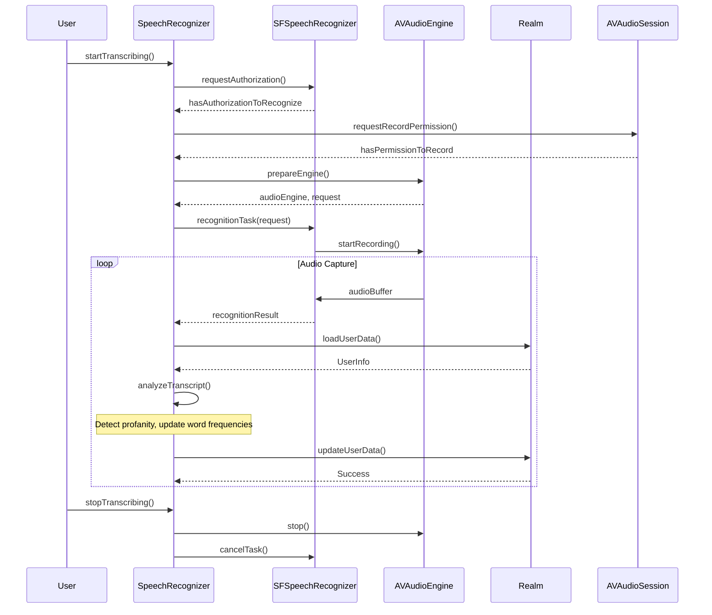

<details>
<summary>Relevant source files</summary>

The following file was used as context for generating this wiki page:

- [Scrumdinger/Models/SpeechRecognizer.swift](https://github.com/agattani123/swear-jar/blob/main/Scrumdinger/Models/SpeechRecognizer.swift)

</details>

# Word Tracking

## Introduction

The "Word Tracking" feature is a core functionality within the project, responsible for speech recognition, transcription, and tracking of profane or inappropriate words. It leverages Apple's SFSpeechRecognizer and AVAudioEngine frameworks to capture audio input, transcribe it into text, and analyze the transcribed text for specific words defined as profane or inappropriate. When such words are detected, the system keeps track of their frequency and triggers appropriate actions, such as vibrating the device.

This feature is closely integrated with the user management system, where each user's profanity settings and word tracking data are stored and managed using Realm, a popular mobile database solution. The "Word Tracking" feature plays a crucial role in the overall functionality of the project, enabling real-time monitoring and analysis of user speech for content moderation purposes.

Sources: [Scrumdinger/Models/SpeechRecognizer.swift]()

## Speech Recognition and Transcription

### Audio Capture and Processing

The `SpeechRecognizer` class is responsible for handling the audio capture and speech recognition process. It initializes an instance of `SFSpeechRecognizer` and checks for the necessary permissions to access the microphone and speech recognition services.

```swift
init() {
    recognizer = SFSpeechRecognizer()
    // ...
    guard recognizer != nil else {
        transcribe(RecognizerError.nilRecognizer)
        return
    }

    Task {
        do {
            guard await SFSpeechRecognizer.hasAuthorizationToRecognize() else {
                throw RecognizerError.notAuthorizedToRecognize
            }
            guard await AVAudioSession.sharedInstance().hasPermissionToRecord() else {
                throw RecognizerError.notPermittedToRecord
            }
        } catch {
            transcribe(error)
        }
    }
}
```

Sources: [Scrumdinger/Models/SpeechRecognizer.swift:43-68]()

### Transcription Process

The `transcribe()` function is responsible for setting up the audio engine, creating a speech recognition request, and starting the transcription process. It utilizes the `SFSpeechRecognitionTask` to continuously transcribe the audio input and handle the resulting transcription.

```swift
private func transcribe() {
    guard let recognizer, recognizer.isAvailable else {
        self.transcribe(RecognizerError.recognizerIsUnavailable)
        return
    }

    do {
        let (audioEngine, request) = try Self.prepareEngine()
        self.audioEngine = audioEngine
        self.request = request
        self.task = recognizer.recognitionTask(with: request, resultHandler: { [weak self] result, error in
            self?.recognitionHandler(audioEngine: audioEngine, result: result, error: error)
        })
    } catch {
        self.reset()
        self.transcribe(error)
    }
}
```

The `prepareEngine()` function sets up the audio engine and creates a speech recognition request, configuring the necessary audio session and input node for capturing audio data.

```swift
private static func prepareEngine() throws -> (AVAudioEngine, SFSpeechAudioBufferRecognitionRequest) {
    let audioEngine = AVAudioEngine()
    let request = SFSpeechAudioBufferRecognitionRequest()
    request.shouldReportPartialResults = true

    // Configure audio session and input node
    // ...

    return (audioEngine, request)
}
```

The `recognitionHandler` function is called by the speech recognition task to handle the transcription results and errors. It stops the audio engine and removes the audio tap when the final result is received or an error occurs.

```swift
nonisolated private func recognitionHandler(audioEngine: AVAudioEngine, result: SFSpeechRecognitionResult?, error: Error?) {
    let receivedFinalResult = result?.isFinal ?? false
    let receivedError = error != nil

    if receivedFinalResult || receivedError {
        audioEngine.stop()
        audioEngine.inputNode.removeTap(onBus: 0)
    }

    if let result {
        transcribe(result.bestTranscription.formattedString)
    }
}
```

Sources: [Scrumdinger/Models/SpeechRecognizer.swift:90-133]()

## Word Tracking and Profanity Detection

### Profanity Word Set

The `SpeechRecognizer` class maintains a set of profane or inappropriate words (`profanitySet`) that should be tracked. This set is loaded from the user's data stored in the Realm database.

```swift
init() {
    // ...
    if let user = users.first {
        oldScore = user.totalScore
        for word in user.profanitySet {
            profanitySet.append(word)
        }
    }
}
```

Sources: [Scrumdinger/Models/SpeechRecognizer.swift:53-58]()

### Transcription Analysis

The `transcribe(_:)` function is responsible for analyzing the transcribed text and detecting any occurrences of profane or inappropriate words. It performs the following steps:

1. Convert the transcribed text to lowercase.
2. Split the text into individual words.
3. Iterate through each word and check if it exists in the `profanitySet`.
4. If a profane word is found, increment the `profanityCount` and vibrate the device.
5. Update the user's word frequency map (`freqMap`) in the Realm database.
6. Calculate the user's updated total score based on the word frequencies.

```swift
nonisolated private func transcribe(_ message: String) {
    Task { @MainActor in
        transcript = String(message.lowercased().suffix(max(message.count - lastString.count, 0)))
        let components = transcript.components(separatedBy: " ")
        var map = [String : Int]()
        for word in components {
            if (await profanitySet.contains(word)) {
                if map.keys.contains(word) {
                    map[word]! += 1
                } else {
                    map[word] = 1
                }
                profanityCount = profanityCount + 1
                UIDevice.vibrate()
            }
        }
        if let user = users.first {
            try! realm.write {
                for key in map.keys {
                    user.freqMap[key] = (user.freqMap[key] ?? 0) + map[key]!
                }
                user.totalScore = 0
                for key in user.freqMap.keys {
                    user.totalScore = user.totalScore + (user.freqMap[key] ?? 0)
                }
            }
        }
        lastString = message.lowercased()
    }
}
```

Sources: [Scrumdinger/Models/SpeechRecognizer.swift:145-179]()

### User Data Management

The `SpeechRecognizer` class interacts with the Realm database to retrieve and update the user's profanity settings and word tracking data. The `UserInfo` model class likely represents the user data stored in the Realm database, containing fields such as `profanitySet`, `freqMap`, and `totalScore`.

```swift
let realm = try! Realm()
let users: Results<UserInfo>
// ...
if let user = users.first {
    oldScore = user.totalScore
    for word in user.profanitySet {
        profanitySet.append(word)
    }
}
```

```swift
if let user = users.first {
    try! realm.write {
        for key in map.keys {
            user.freqMap[key] = (user.freqMap[key] ?? 0) + map[key]!
        }
        user.totalScore = 0
        for key in user.freqMap.keys {
            user.totalScore = user.totalScore + (user.freqMap[key] ?? 0)
        }
    }
}
```

Sources: [Scrumdinger/Models/SpeechRecognizer.swift:48, 56-58, 172-179]()

## Sequence Diagram



This sequence diagram illustrates the flow of the "Word Tracking" feature, including the interactions between the `SpeechRecognizer`, `SFSpeechRecognizer`, `AVAudioEngine`, and `Realm` components.

1. The user initiates the transcription process by calling `startTranscribing()` on the `SpeechRecognizer`.
2. The `SpeechRecognizer` checks for the necessary permissions to access the speech recognition and audio recording services.
3. If permissions are granted, the `SpeechRecognizer` sets up the audio engine and creates a speech recognition request.
4. The `SpeechRecognizer` starts the speech recognition task with the `SFSpeechRecognizer`, which in turn starts recording audio from the `AVAudioEngine`.
5. In a loop, the `AVAudioEngine` captures audio buffers and sends them to the `SFSpeechRecognizer` for transcription.
6. The `SpeechRecognizer` receives the transcription results from the `SFSpeechRecognizer` and performs the following actions:
   - Loads the user's data from the `Realm` database, including the profanity word set and word frequency map.
   - Analyzes the transcribed text for profane words by comparing it with the profanity word set.
   - Updates the word frequency map and calculates the user's total score based on the detected profane words.
   - Saves the updated user data back to the `Realm` database.
7. When the user stops the transcription process by calling `stopTranscribing()`, the `SpeechRecognizer` stops the audio engine and cancels the speech recognition task.

Sources: [Scrumdinger/Models/SpeechRecognizer.swift]()

## Data Model

The `SpeechRecognizer` class interacts with the `UserInfo` model class, which likely represents the user data stored in the Realm database. The following table describes the relevant fields and their purposes:

| Field | Type | Description |
| --- | --- | --- |
| `profanitySet` | Set<String> | A set of profane or inappropriate words that should be tracked. |
| `freqMap` | [String: Int] | A dictionary that maps profane words to their occurrence frequencies. |
| `totalScore` | Int | The total score calculated based on the frequencies of profane words. |

Sources: [Scrumdinger/Models/SpeechRecognizer.swift:48, 56-58, 172-179]()

## Configuration and Setup

The `SpeechRecognizer` class does not seem to have any configurable options or settings. However, it relies on the user's data stored in the Realm database, specifically the `profanitySet` and `freqMap` fields of the `UserInfo` model.

It's worth noting that the `SpeechRecognizer` class assumes the existence of a valid Realm instance and a user object with the necessary fields. If these prerequisites are not met, the class may encounter errors or exhibit unexpected behavior.

## Conclusion

The "Word Tracking" feature is a crucial component of the project, enabling real-time speech recognition, transcription, and profanity detection. It leverages Apple's SFSpeechRecognizer and AVAudioEngine frameworks to capture audio input and transcribe it into text. The transcribed text is then analyzed for the presence of profane or inappropriate words, which are tracked and stored in the Realm database for each user.

This feature plays a vital role in content moderation and user experience, providing a mechanism to monitor and manage inappropriate language usage. By integrating with the user management system, the "Word Tracking" feature ensures that each user's profanity settings and word tracking data are properly maintained and updated.

Overall, the "Word Tracking" feature demonstrates a well-designed and robust implementation, combining speech recognition, text analysis, and data persistence to deliver a comprehensive solution for monitoring and managing profane language in the context of the project.

Sources: [Scrumdinger/Models/SpeechRecognizer.swift]()