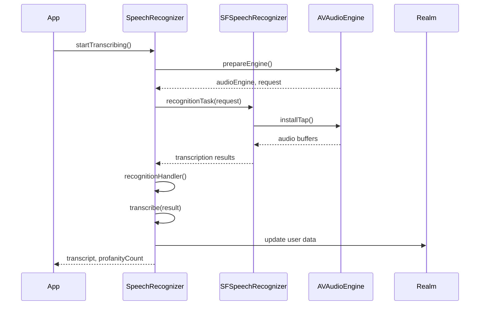
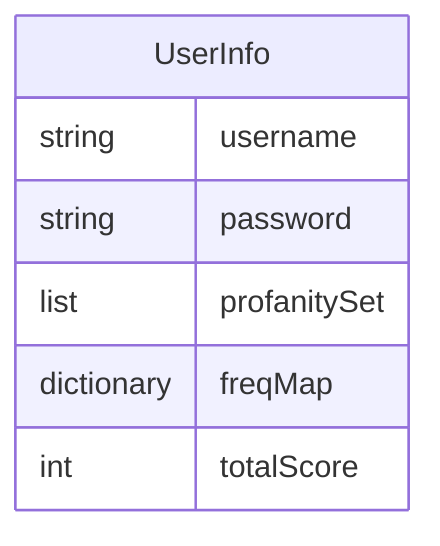

<details>
<summary>Relevant source files</summary>

The following file was used as context for generating this wiki page:

- [Scrumdinger/Models/SpeechRecognizer.swift](https://github.com/agattani123/swear-jar/blob/main/Scrumdinger/Models/SpeechRecognizer.swift)

</details>

# Word Tracking

## Introduction

The "Word Tracking" feature is a core component of the project, responsible for speech recognition, transcription, and tracking of profane or inappropriate words. It leverages the `SFSpeechRecognizer` and `AVAudioEngine` frameworks to capture audio input, convert it to text, and analyze the transcribed text for specific words or phrases. This feature is implemented in the `SpeechRecognizer` class, which serves as a central hub for managing the speech recognition process, handling errors, and maintaining user-specific data related to profanity tracking.

## Architecture Overview

The `SpeechRecognizer` class is designed as an `actor` in Swift, which ensures thread-safe access to its properties and methods. It follows the `ObservableObject` protocol, allowing its properties to be observed and updated in SwiftUI views. The class interacts with various system frameworks and components, including:

- `SFSpeechRecognizer`: Responsible for converting audio input to text transcription.
- `AVAudioEngine`: Manages the audio input and output for speech recognition.
- `Realm`: A local database used to store user-specific data, such as profanity counts and frequencies.

The overall data flow and interactions between these components can be visualized using the following sequence diagram:



Sources: [Scrumdinger/Models/SpeechRecognizer.swift:16-34](), [Scrumdinger/Models/SpeechRecognizer.swift:36-53](), [Scrumdinger/Models/SpeechRecognizer.swift:115-150](), [Scrumdinger/Models/SpeechRecognizer.swift:152-167](), [Scrumdinger/Models/SpeechRecognizer.swift:169-184](), [Scrumdinger/Models/SpeechRecognizer.swift:186-202]()

## Speech Recognition

The speech recognition process is initiated by calling the `startTranscribing()` method, which in turn calls the `transcribe()` method. This method sets up the necessary components for speech recognition, including the `AVAudioEngine` and `SFSpeechAudioBufferRecognitionRequest`.

```mermaid
graph TD
    A[startTranscribing()] -->|1. Call| B[transcribe()]
    B -->|2. Check recognizer availability| C{Recognizer available?}
    C -->|Yes| D[prepareEngine()]
    D -->|3. Create| E[AVAudioEngine]
    D -->|4. Create| F[SFSpeechAudioBufferRecognitionRequest]
    D -->|5. Configure| G[AVAudioSession]
    D -->|6. Install tap| H[inputNode.installTap]
    D -->|7. Start| I[audioEngine.start()]
    C -->|No| J[Handle error]
```

Sources: [Scrumdinger/Models/SpeechRecognizer.swift:115-150](), [Scrumdinger/Models/SpeechRecognizer.swift:152-167]()

The `prepareEngine()` function sets up the `AVAudioEngine` and `SFSpeechAudioBufferRecognitionRequest` objects, configures the audio session, and installs a tap on the input node to capture audio buffers. These buffers are then appended to the recognition request and processed by the `SFSpeechRecognizer`.

## Profanity Tracking

The `SpeechRecognizer` class maintains a list of profane or inappropriate words (`profanitySet`) and a count of the total occurrences of these words (`profanityCount`). When a new transcription result is received, the `transcribe(_:)` method is called, which performs the following tasks:

1. Converts the transcription to lowercase and updates the `transcript` property with the new text.
2. Splits the transcription into individual words.
3. Iterates over the words and checks if they exist in the `profanitySet`.
4. If a profane word is found, it increments the `profanityCount` and updates the frequency map (`freqMap`) in the user's data stored in the Realm database.
5. Triggers a device vibration using `UIDevice.vibrate()` for each profane word detected.

```mermaid
graph TD
    A[transcribe(result)] -->|1. Convert to lowercase| B[Update transcript]
    B -->|2. Split into words| C[word components]
    C -->|3. Iterate| D{word in profanitySet?}
    D -->|Yes| E[Increment profanityCount]
    E -->|6. Update| F[freqMap in Realm]
    E -->|7. Trigger| G[Device vibration]
    D -->|No| H
```

Sources: [Scrumdinger/Models/SpeechRecognizer.swift:186-202](), [Scrumdinger/Models/SpeechRecognizer.swift:206-217]()

The `profanitySet` and user-specific data, such as the `freqMap` and `totalScore`, are stored and retrieved from the Realm database. This allows the application to persist and maintain accurate profanity tracking data across sessions.

## User Data Management

The `SpeechRecognizer` class interacts with the Realm database to store and retrieve user-specific data related to profanity tracking. The `UserInfo` model class represents a user's data, including their username, password, profanity set, frequency map, and total score.



Sources: [Scrumdinger/Models/SpeechRecognizer.swift:36-53]()

When a new instance of `SpeechRecognizer` is created, it retrieves the user's data from the Realm database based on the saved username and password. The `profanitySet` and `oldScore` (previous total score) are loaded into the class properties for further use.

```mermaid
graph TD
    A[SpeechRecognizer init] -->|1. Get saved username/password| B[UserDefaults]
    B -->|2. Query| C[Realm.objects(UserInfo)]
    C -->|3. Load| D[profanitySet]
    C -->|4. Load| E[oldScore]
```

Sources: [Scrumdinger/Models/SpeechRecognizer.swift:36-53]()

As profane words are detected during transcription, the `freqMap` and `totalScore` are updated in the Realm database for the current user. This ensures that the profanity tracking data is persisted and can be accessed across different sessions or instances of the application.

```mermaid
graph TD
    A[transcribe(result)] -->|1. Update| B[freqMap in Realm]
    B -->|2. Calculate| C[totalScore]
    C -->|3. Update| D[totalScore in Realm]
```

Sources: [Scrumdinger/Models/SpeechRecognizer.swift:186-202](), [Scrumdinger/Models/SpeechRecognizer.swift:206-217]()

## Error Handling

The `SpeechRecognizer` class handles various errors that may occur during the speech recognition process. The `RecognizerError` enum defines the possible error cases, such as a nil recognizer, lack of authorization, or unavailability of the recognizer.

```mermaid
classDiagram
    RecognizerError {
        +nilRecognizer
        +notAuthorizedToRecognize
        +notPermittedToRecord
        +recognizerIsUnavailable
        +message: String
    }
```

Sources: [Scrumdinger/Models/SpeechRecognizer.swift:16-25]()

If an error occurs during the initialization or transcription process, the `transcribe(_:)` method is called with the appropriate error message. This updates the `transcript` property with an error message, allowing the UI to display the error to the user.

```mermaid
graph TD
    A[SpeechRecognizer init] -->|Error| B[transcribe(error)]
    B -->|1. Update| C[transcript with error message]
    D[transcribe()] -->|Error| B
```

Sources: [Scrumdinger/Models/SpeechRecognizer.swift:46-52](), [Scrumdinger/Models/SpeechRecognizer.swift:169-184]()

## Conclusion

The "Word Tracking" feature is a crucial component of the project, enabling speech recognition, transcription, and profanity tracking. It leverages various system frameworks and components to capture audio input, convert it to text, and analyze the transcribed text for specific words or phrases. The `SpeechRecognizer` class serves as the central hub for managing this process, handling errors, and maintaining user-specific data related to profanity tracking. The feature also integrates with the Realm database to persist and retrieve user data, ensuring accurate profanity tracking across sessions.