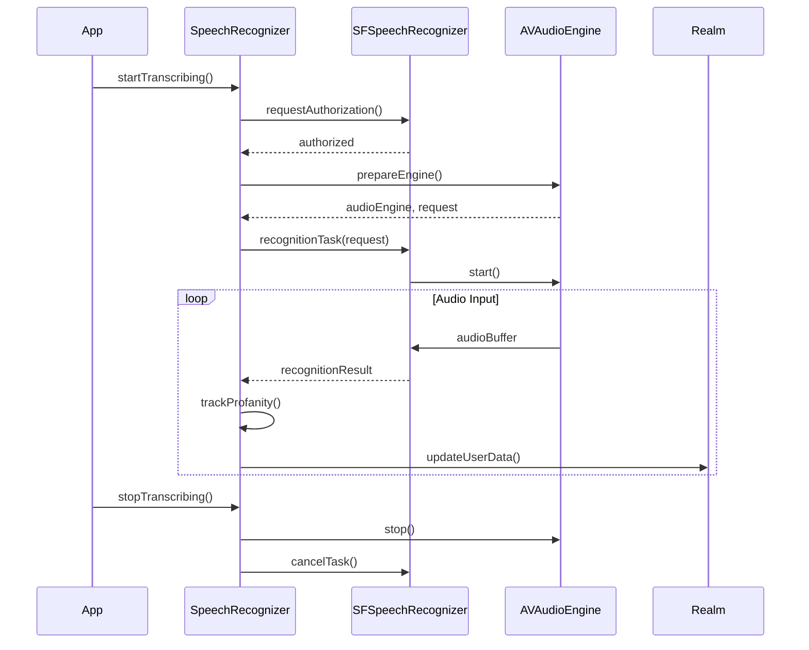

<details>
<summary>Relevant source files</summary>

The following file was used as context for generating this wiki page:

- [Scrumdinger/Models/SpeechRecognizer.swift](https://github.com/agattani123/swear-jar/blob/main/Scrumdinger/Models/SpeechRecognizer.swift)

</details>

# Word Tracking

## Introduction

The "Word Tracking" feature in this project is responsible for speech recognition, transcription, and tracking of profane or inappropriate words. It utilizes the `SpeechRecognizer` class, which is an actor that handles the speech recognition process and manages the associated data. This feature is likely part of a larger application focused on monitoring and potentially filtering or censoring inappropriate language.

## Speech Recognition and Transcription

The `SpeechRecognizer` class is the core component responsible for speech recognition and transcription. It leverages the `SFSpeechRecognizer` and `AVAudioEngine` frameworks provided by Apple to capture and process audio input.

### Initialization

The `SpeechRecognizer` initializer performs the following tasks:

1. Initializes the `SFSpeechRecognizer` instance.
2. Retrieves the user's profanity set and score from the Realm database.
3. Requests permission to access the speech recognizer and microphone.

```swift
init() {
    recognizer = SFSpeechRecognizer()
    // Retrieve user data from Realm
    ...
    guard recognizer != nil else {
        transcribe(RecognizerError.nilRecognizer)
        return
    }

    Task {
        do {
            guard await SFSpeechRecognizer.hasAuthorizationToRecognize() else {
                throw RecognizerError.notAuthorizedToRecognize
            }
            guard await AVAudioSession.sharedInstance().hasPermissionToRecord() else {
                throw RecognizerError.notPermittedToRecord
            }
        } catch {
            transcribe(error)
        }
    }
}
```

Sources: [Scrumdinger/Models/SpeechRecognizer.swift:27-65]()

### Transcription Process

The `transcribe()` method is responsible for setting up the speech recognition task and handling the resulting transcription.

1. It prepares the `AVAudioEngine` and `SFSpeechAudioBufferRecognitionRequest`.
2. It creates a `SFSpeechRecognitionTask` and starts transcribing audio.
3. The `recognitionHandler` method is called for each recognition result, updating the `transcript` property.

```swift
private func transcribe() {
    guard let recognizer, recognizer.isAvailable else {
        self.transcribe(RecognizerError.recognizerIsUnavailable)
        return
    }

    do {
        let (audioEngine, request) = try Self.prepareEngine()
        self.audioEngine = audioEngine
        self.request = request
        self.task = recognizer.recognitionTask(with: request, resultHandler: { [weak self] result, error in
            self?.recognitionHandler(audioEngine: audioEngine, result: result, error: error)
        })
    } catch {
        self.reset()
        self.transcribe(error)
    }
}
```

Sources: [Scrumdinger/Models/SpeechRecognizer.swift:89-107]()

### Profanity Tracking

The `transcribe(_:)` method is responsible for tracking profane or inappropriate words in the transcribed text.

1. It converts the transcribed text to lowercase.
2. It splits the text into individual words.
3. It checks each word against the user's profanity set.
4. If a profane word is found, it increments the profanity count and updates the user's frequency map and total score in the Realm database.
5. It also triggers a vibration on the device when a profane word is detected.

```swift
nonisolated private func transcribe(_ message: String) {
    Task { @MainActor in
        transcript = String(message.lowercased().suffix(max(message.count - lastString.count, 0)))
        let components = transcript.components(separatedBy: " ")
        var map = [String : Int]()
        for word in components {
            if (await profanitySet.contains(word)) {
                if map.keys.contains(word) {
                    map[word]! += 1
                } else {
                    map[word] = 1
                }
                profanityCount = profanityCount + 1
                UIDevice.vibrate()
            }
        }
        if let user = users.first {
            try! realm.write {
                for key in map.keys {
                    user.freqMap[key] = (user.freqMap[key] ?? 0) + map[key]!
                }
                user.totalScore = 0
                for key in user.freqMap.keys {
                    user.totalScore = user.totalScore + (user.freqMap[key] ?? 0)
                }
            }
        }
        lastString = message.lowercased()
    }
}
```

Sources: [Scrumdinger/Models/SpeechRecognizer.swift:144-173]()

## Data Model

The `SpeechRecognizer` class interacts with the Realm database to store and retrieve user data related to profanity tracking.

### UserInfo

The `UserInfo` model likely represents a user in the application and stores the following relevant properties:

- `profanitySet`: A set of profane or inappropriate words.
- `freqMap`: A dictionary that maps profane words to their frequency of occurrence.
- `totalScore`: A score representing the total count of profane words used by the user.

```swift
let users: Results<UserInfo>
```

Sources: [Scrumdinger/Models/SpeechRecognizer.swift:30]()

## Sequence Diagram

The following sequence diagram illustrates the flow of the speech recognition and profanity tracking process:



This diagram shows the interaction between the `SpeechRecognizer`, `SFSpeechRecognizer`, `AVAudioEngine`, and `Realm` components during the speech recognition and profanity tracking process.

1. The app initiates the transcription process by calling `startTranscribing()` on the `SpeechRecognizer`.
2. The `SpeechRecognizer` requests authorization from the `SFSpeechRecognizer` and prepares the `AVAudioEngine`.
3. A speech recognition task is created with the `SFSpeechRecognizer`, and the `AVAudioEngine` starts capturing audio input.
4. For each audio buffer received, the `SFSpeechRecognizer` sends recognition results to the `SpeechRecognizer`.
5. The `SpeechRecognizer` tracks profanity in the transcribed text and updates the user's data in the `Realm` database.
6. When the app calls `stopTranscribing()`, the `SpeechRecognizer` stops the `AVAudioEngine` and cancels the recognition task.

Sources: [Scrumdinger/Models/SpeechRecognizer.swift]()

## Configuration

The `SpeechRecognizer` class does not appear to have any configurable options or settings based on the provided source file.

## Conclusion

The "Word Tracking" feature in this project leverages the `SpeechRecognizer` class to perform speech recognition and transcription. It tracks profane or inappropriate words in the transcribed text and updates the user's data in the Realm database accordingly. This feature is likely part of a larger application focused on monitoring and potentially filtering or censoring inappropriate language.