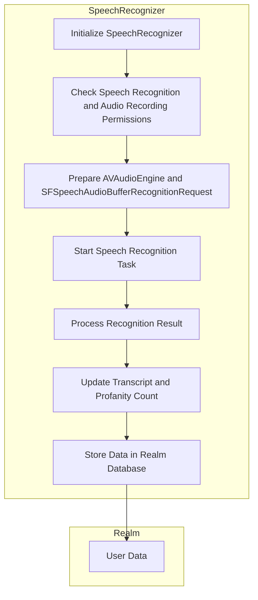
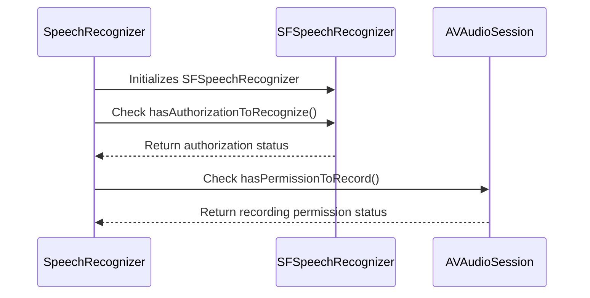
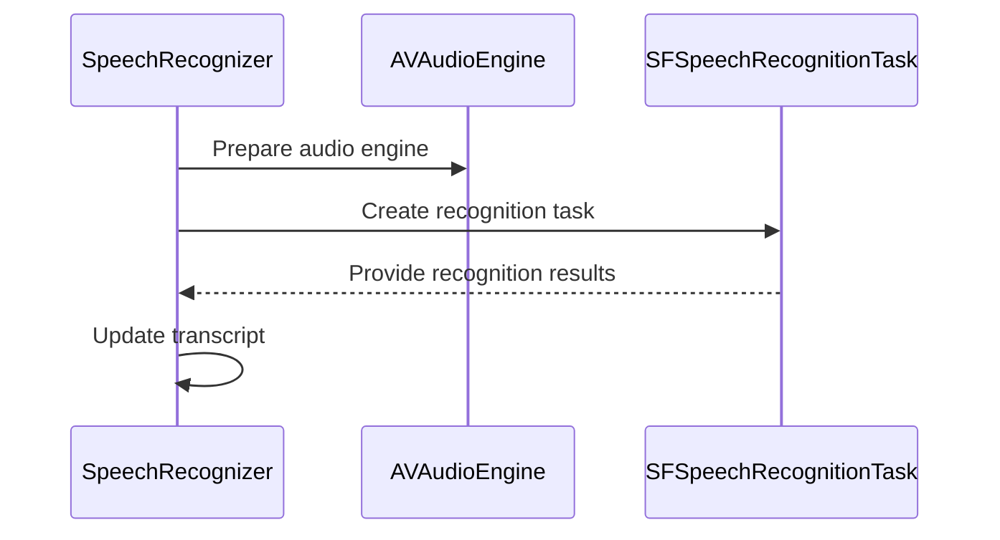
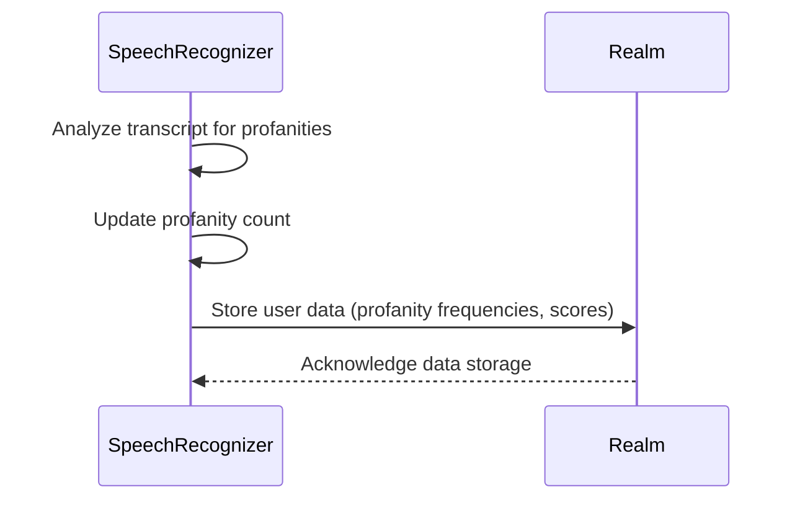
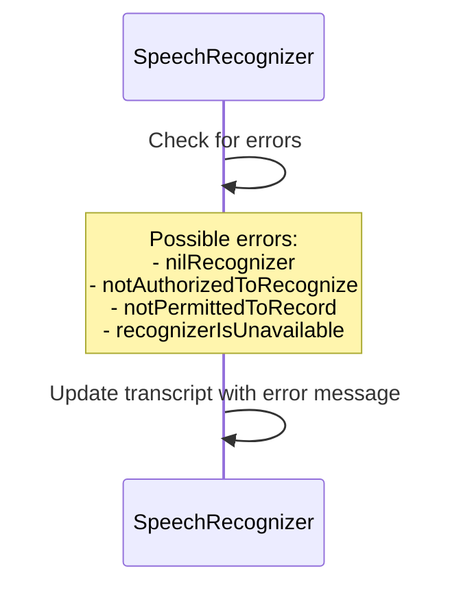

Relevant source files

The following file was used as context for generating this wiki page:

- [Scrumdinger/Models/SpeechRecognizer.swift](https://github.com/agattani123/swear-jar/blob/main/Scrumdinger/Models/SpeechRecognizer.swift)

# Word Tracking

## Introduction

The "Word Tracking" feature in this project is responsible for speech recognition, transcription, and tracking of profane or inappropriate words. It utilizes the `SpeechRecognizer` class, which leverages the `SFSpeechRecognizer` and `AVAudioEngine` frameworks to capture and transcribe audio input. The transcribed text is then analyzed for the presence of profane words, and a count is maintained. Additionally, the feature integrates with the Realm database to store user information, including profanity counts and frequencies.

Sources: [Scrumdinger/Models/SpeechRecognizer.swift]()

## Architecture and Data Flow

The `SpeechRecognizer` class follows the actor model, ensuring thread-safe access to its properties and methods. It encapsulates the speech recognition functionality and manages the audio engine, recognition request, and task. The class also interacts with the Realm database to store and retrieve user-related data, such as profanity sets and scores.

Here's a high-level overview of the data flow:

Sources: [Scrumdinger/Models/SpeechRecognizer.swift:18-24](), [Scrumdinger/Models/SpeechRecognizer.swift:26-31](), [Scrumdinger/Models/SpeechRecognizer.swift:33-40](), [Scrumdinger/Models/SpeechRecognizer.swift:91-117](), [Scrumdinger/Models/SpeechRecognizer.swift:119-142](), [Scrumdinger/Models/SpeechRecognizer.swift:144-166](), [Scrumdinger/Models/SpeechRecognizer.swift:168-188](), [Scrumdinger/Models/SpeechRecognizer.swift:190-201]()

## Speech Recognition Setup

The `SpeechRecognizer` class initializes an instance of `SFSpeechRecognizer` and checks for the necessary permissions to access the speech recognizer and microphone. If the permissions are granted, it proceeds with setting up the audio engine and recognition request.

Sources: [Scrumdinger/Models/SpeechRecognizer.swift:33-40](), [Scrumdinger/Models/SpeechRecognizer.swift:91-117](), [Scrumdinger/Models/SpeechRecognizer.swift:119-142](), [Scrumdinger/Models/SpeechRecognizer.swift:190-201]()

## Speech Recognition and Transcription

Once the necessary permissions are granted, the `SpeechRecognizer` class sets up the audio engine and recognition request. It then starts the speech recognition task, which continuously transcribes the audio input and updates the `transcript` property.

Sources: [Scrumdinger/Models/SpeechRecognizer.swift:119-142](), [Scrumdinger/Models/SpeechRecognizer.swift:144-166]()

## Profanity Tracking and Realm Integration

As the `transcript` is updated, the `SpeechRecognizer` class analyzes the text for the presence of profane words. It maintains a count of profanities and stores user-related data, such as profanity frequencies and scores, in the Realm database.

Sources: [Scrumdinger/Models/SpeechRecognizer.swift:168-188](), [Scrumdinger/Models/SpeechRecognizer.swift:41-45](), [Scrumdinger/Models/SpeechRecognizer.swift:47-54]()

## Error Handling

The `SpeechRecognizer` class handles various errors that may occur during the speech recognition process, such as a nil recognizer, lack of authorization, or unavailability of the recognizer. These errors are propagated through the `transcribe` method and displayed in the `transcript` property.

Sources: [Scrumdinger/Models/SpeechRecognizer.swift:18-24](), [Scrumdinger/Models/SpeechRecognizer.swift:190-201]()

## Key Classes and Structures

| Class/Struct | Description |
| --- | --- |
| `SpeechRecognizer` | The main class responsible for speech recognition, transcription, profanity tracking, and Realm integration. |
| `RecognizerError` | An enum representing various errors that can occur during the speech recognition process. |
| `UserInfo` (Realm Object) | A Realm object representing user information, including profanity sets, frequencies, and scores. |

Sources: [Scrumdinger/Models/SpeechRecognizer.swift:18-24](), [Scrumdinger/Models/SpeechRecognizer.swift:26-31](), [Scrumdinger/Models/SpeechRecognizer.swift:33-40]()

## Conclusion

The "Word Tracking" feature in this project provides a comprehensive solution for speech recognition, transcription, and profanity tracking. It leverages the `SFSpeechRecognizer` and `AVAudioEngine` frameworks to capture and transcribe audio input, and integrates with the Realm database to store user-related data. The feature handles various error scenarios and provides a robust architecture for managing the speech recognition process.