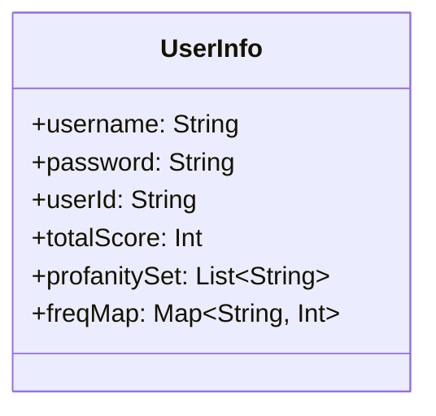
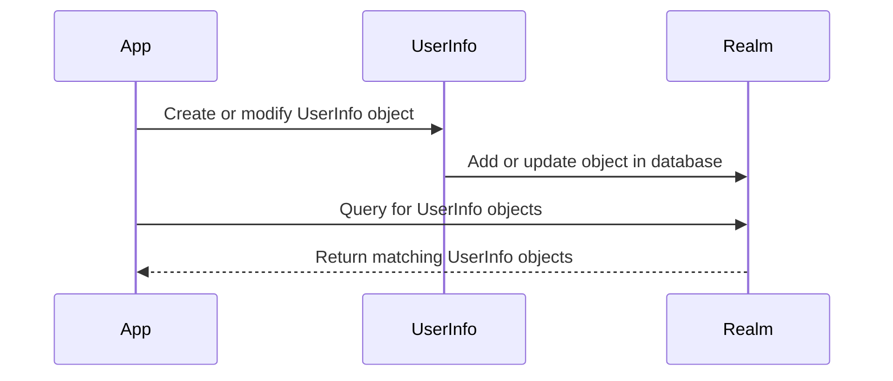
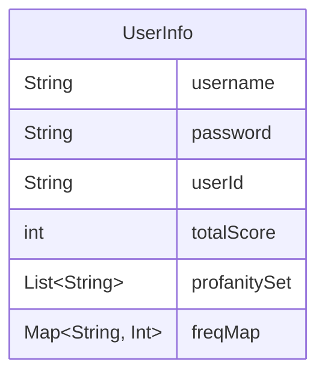

Relevant source files

The following file was used as context for generating this wiki page:

- [Scrumdinger/Models/UserInfo.swift](https://github.com/agattani123/swear-jar/blob/main/Scrumdinger/Models/UserInfo.swift)

# Data Storage and Management

## Introduction

The "Data Storage and Management" feature in the Scrumdinger project revolves around the `UserInfo` class, which is a Realm Object model. This class is responsible for storing and managing user-related data, including the user's username, password, unique identifier (userId), total score, a set of profanity words, and a frequency map for tracking the usage of profane words.

The `UserInfo` class serves as the central data model for user information, enabling the application to persist and retrieve user data efficiently using the Realm database.

## Data Model

The `UserInfo` class is defined as a Realm Object, which means it inherits from the `Object` class provided by the Realm framework. This allows instances of `UserInfo` to be stored and retrieved from the Realm database.

### Class Properties

The `UserInfo` class has the following properties:

#### User Identification

- `username: String`: Stores the user's username.
- `password: String`: Stores the user's password.
- `userId: String`: Stores a unique identifier for the user.

#### Score Tracking

- `totalScore: Int`: Keeps track of the user's total score.

#### Profanity Management

- `profanitySet: List<String>`: A Realm `List` that stores a set of profane words.
- `freqMap: Map<String, Int>`: A Realm `Map` that tracks the frequency of usage for each profane word.

Sources: [Scrumdinger/Models/UserInfo.swift:3-10]()

## Data Storage

The `UserInfo` class is designed to be stored and retrieved from the Realm database. Realm is an embedded, object-oriented database that provides efficient data storage and retrieval capabilities.

When an instance of `UserInfo` is created or modified, it can be added or updated in the Realm database using the appropriate Realm APIs. Similarly, existing `UserInfo` objects can be queried and retrieved from the database based on various criteria, such as the `userId` or `username`.

Sources: [Scrumdinger/Models/UserInfo.swift]()

## Profanity Management

The `UserInfo` class includes two properties specifically designed for managing profane words:

1. `profanitySet: List<String>`: This Realm `List` property stores a set of profane words. It allows for efficient storage and retrieval of the profanity word list associated with a user.

2. `freqMap: Map<String, Int>`: This Realm `Map` property tracks the frequency of usage for each profane word. The key represents the profane word, and the value represents the number of times it has been used.

These properties enable the application to maintain a personalized list of profane words for each user and monitor their usage patterns.

Sources: [Scrumdinger/Models/UserInfo.swift:8-9]()

## Conclusion

The `UserInfo` class in the Scrumdinger project serves as the central data model for storing and managing user-related information, including user credentials, scores, and profanity management data. By leveraging the Realm database, the application can efficiently persist and retrieve user data, ensuring data integrity and performance. The inclusion of properties like `profanitySet` and `freqMap` allows for personalized profanity management and usage tracking for each user.