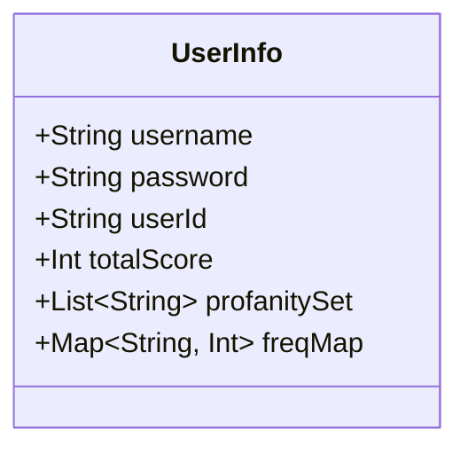

<details>
<summary>Relevant source files</summary>

The following file was used as context for generating this wiki page:

- [Scrumdinger/Models/UserInfo.swift](https://github.com/agattani123/swear-jar/blob/main/Scrumdinger/Models/UserInfo.swift)

</details>

# Data Storage and Management

## Introduction

The "Data Storage and Management" component within the Scrumdinger project is responsible for handling user-related data, including authentication credentials, profanity tracking, and scoring information. It utilizes the Realm database to persist and manage this data efficiently. The primary data model is the `UserInfo` class, which encapsulates various properties and collections related to user information.

## Data Model

The `UserInfo` class is a Realm Object that serves as the central data model for storing and managing user-related information. It consists of the following properties:

### Properties

- `username: String`: Stores the user's username.
- `password: String`: Stores the user's password.
- `userId: String`: A unique identifier for the user.
- `totalScore: Int`: Keeps track of the user's total score, likely related to profanity tracking.
- `profanitySet: List<String>`: A Realm `List` that stores a set of profane words or phrases associated with the user.
- `freqMap: Map<String, Int>`: A Realm `Map` that likely stores the frequency of occurrence for each profane word or phrase.

```swift
class UserInfo: Object {
    @objc dynamic var username: String = ""
    @objc dynamic var password: String = ""
    @objc dynamic var userId: String = ""
    @objc dynamic var totalScore: Int = 0
    dynamic var profanitySet: List<String> = List<String>()
    dynamic var freqMap: Map<String, Int> = Map()
}
```

Sources: [Scrumdinger/Models/UserInfo.swift:8-14]()

## Data Storage and Persistence

The `UserInfo` class inherits from Realm's `Object` class, which means instances of this class are automatically persisted and managed by the Realm database. Realm provides a fast and efficient way to store and query data, making it suitable for handling user-related data in the Scrumdinger application.

## Data Access and Manipulation

The properties of the `UserInfo` class can be accessed and modified directly, allowing for easy management of user data. For example, the `username` and `password` properties can be used for authentication purposes, while the `profanitySet` and `freqMap` collections can be utilized for tracking profane words or phrases used by the user and their respective frequencies.



Sources: [Scrumdinger/Models/UserInfo.swift:8-14]()

## Potential Use Cases

Based on the structure of the `UserInfo` class, potential use cases within the Scrumdinger project could include:

- User authentication and authorization
- Tracking and scoring user profanity usage
- Maintaining a history of profane words or phrases used by the user
- Analyzing the frequency of profanity usage for individual words or phrases

However, without access to the broader codebase, it is difficult to provide more specific details on how this data model is utilized within the application's functionality.

## Conclusion

The "Data Storage and Management" component in the Scrumdinger project revolves around the `UserInfo` class, which serves as the central data model for storing and managing user-related information, such as authentication credentials, profanity tracking, and scoring data. By leveraging Realm's efficient database management system, the application can persist and retrieve this data seamlessly, enabling various features and functionalities related to user management and profanity tracking.