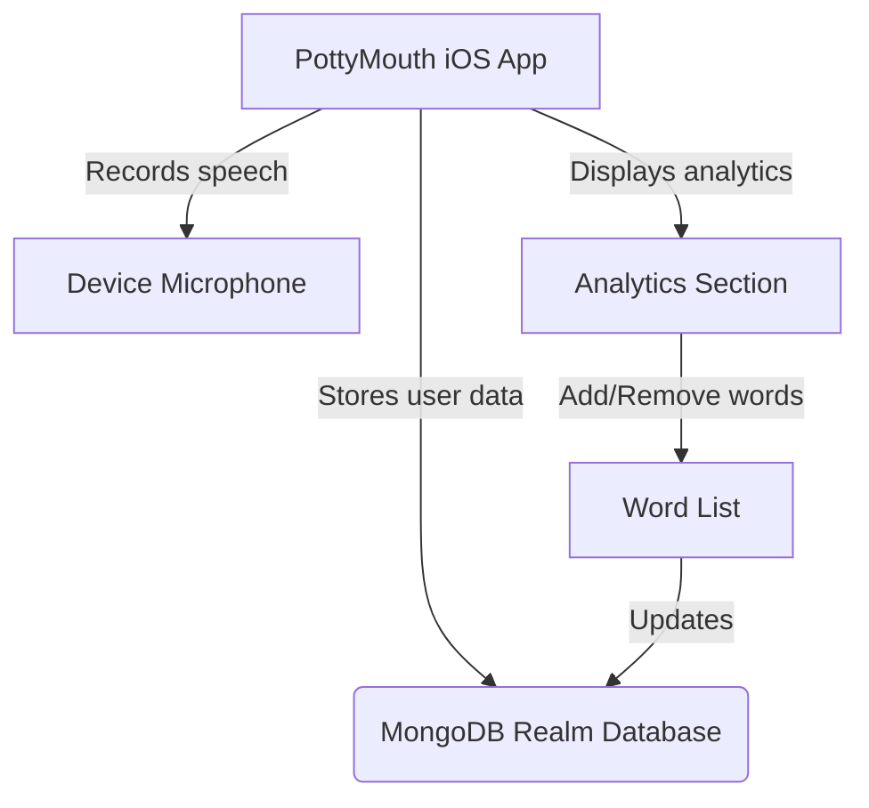
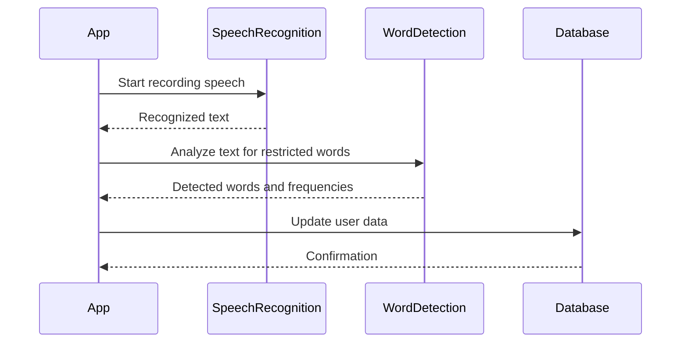
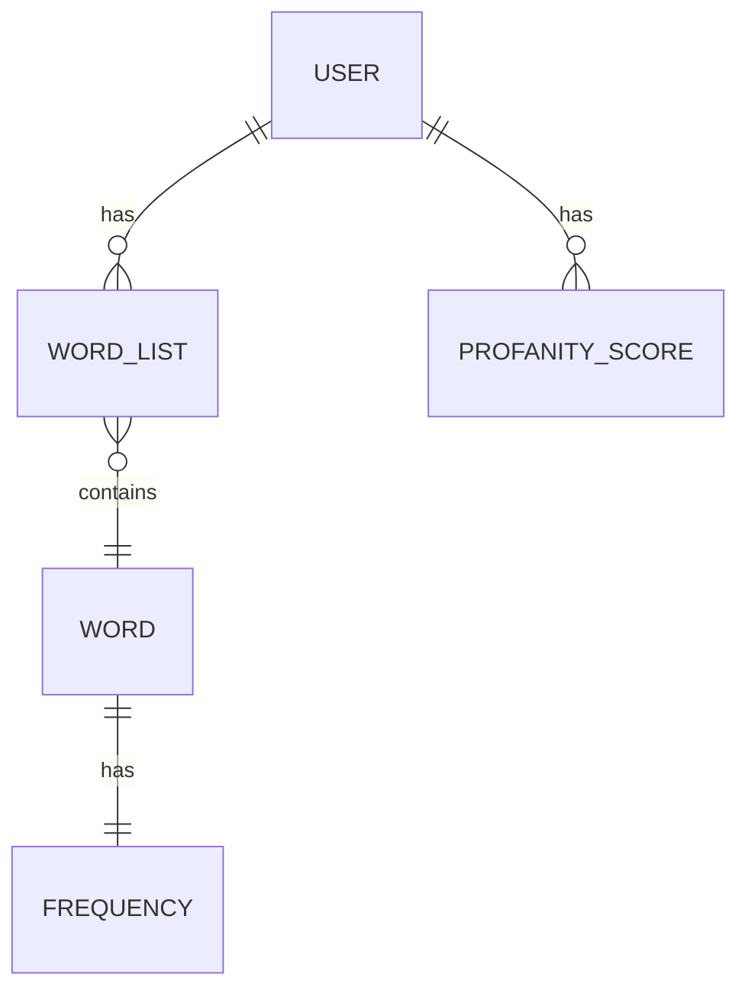
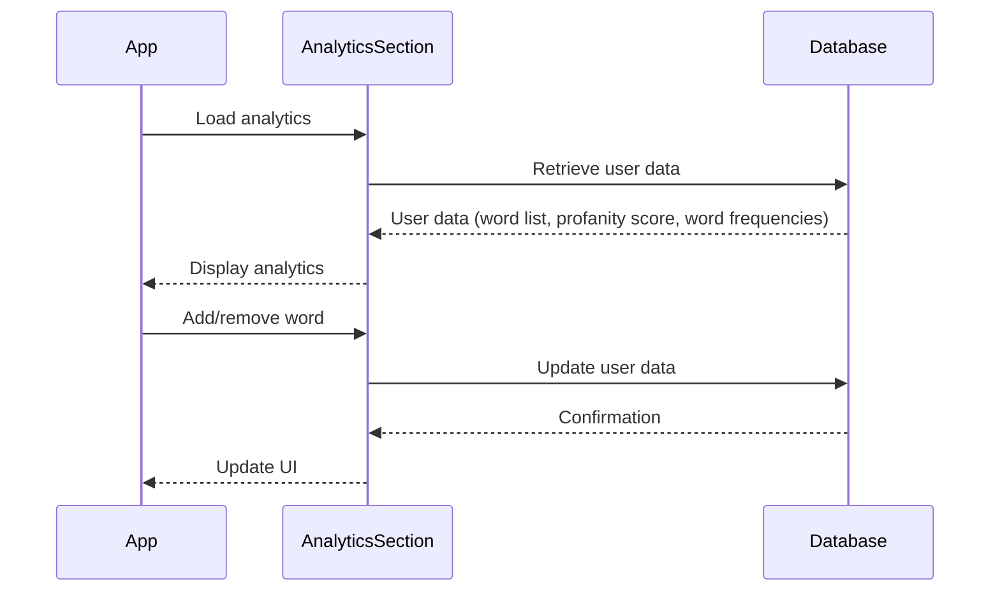

Relevant source files

The following files were used as context for generating this wiki page:

- [README.md](https://github.com/agattani123/swear-jar/blob/main/README.md)

# Deployment and Distribution

## Introduction

PottyMouth is an iOS application built with Swift that serves as a digital swear jar. It allows users to create a list of words they want to limit or avoid using, and the app records their speech through the device's microphone. Whenever a word from the user's list is detected, the app increments a "profanity score" and tracks the frequency of each word used. The app provides an Analytics section where users can view the frequency of their "no-no" words, add or remove words from their list in real-time, and monitor their progress in improving their speaking habits. Sources: [README.md:1-19]()

## Application Architecture

The PottyMouth application is built using the Swift programming language and runs on iOS devices. It leverages the MongoDB Realm database to store user information, such as their list of restricted words and profanity scores. However, for privacy reasons, the application does not store the user's speech transcript. Sources: [README.md:16-17]()

The application follows a typical client-server architecture, where the iOS app acts as the client and interacts with the MongoDB Realm database as the server. The app records the user's speech through the device's microphone and processes it locally to detect the presence of restricted words. When a restricted word is detected, the app updates the user's profanity score and word frequency data, which is then stored in the MongoDB Realm database. The Analytics section of the app retrieves and displays this data, allowing users to monitor their progress and manage their word list. Sources: [README.md:1-19]()

## Speech Recognition and Word Detection

The core functionality of PottyMouth involves speech recognition and word detection. The application likely utilizes Apple's Speech Recognition API or a third-party speech recognition library to convert the user's speech into text. This text is then analyzed to detect the presence of any words from the user's restricted word list.

The speech recognition process likely involves the following steps:

1. The app starts recording the user's speech through the device's microphone.
2. The recorded audio is sent to the speech recognition component (either Apple's API or a third-party library) for conversion to text.
3. The recognized text is returned to the app.
4. The app passes the recognized text to the word detection component, which analyzes it for the presence of any words from the user's restricted word list.
5. The word detection component returns the detected words and their frequencies to the app.
6. The app updates the user's profanity score and word frequency data in the MongoDB Realm database.

Sources: [README.md:1-19]() (Inferred from the application's described functionality)

## Analytics and Word List Management

PottyMouth provides an Analytics section where users can view the frequency of their "no-no" words and manage their word list by adding or removing words in real-time.

The Analytics section likely retrieves the user's word list, profanity score, and word frequencies from the MongoDB Realm database and displays them in a user-friendly format. Users can interact with the Analytics section to add or remove words from their list, which updates the corresponding data in the database.

The process for managing the word list and viewing analytics likely involves the following steps:

1. The app loads the Analytics section.
2. The Analytics section retrieves the user's word list, profanity score, and word frequencies from the MongoDB Realm database.
3. The retrieved data is displayed in the Analytics section's user interface.
4. When the user adds or removes a word from their list, the Analytics section updates the corresponding data in the MongoDB Realm database.
5. The Analytics section's user interface is updated to reflect the changes.

Sources: [README.md:8-15]()

## Potential Future Enhancements

According to the README file, the developers of PottyMouth have plans to extend the application's use cases and functionality:

- Create packages for educational and charity contexts, potentially tailoring the application's features and analytics to suit these specific use cases.
- Integrate with payment applications like Venmo to enable users to donate to charities based on their profanity score, creating a charitable aspect to the application.
- Implement a leaderboard system to foster an online community around PottyMouth, potentially encouraging users to improve their speaking habits through friendly competition.

Sources: [README.md:18-21]()

## Conclusion

PottyMouth is an innovative iOS application that serves as a digital swear jar, helping users improve their speaking habits by tracking and limiting the use of certain words. The application leverages speech recognition technology, word detection algorithms, and a MongoDB Realm database to provide users with real-time analytics and the ability to manage their restricted word list. While the current implementation focuses on personal use cases, the developers have plans to extend the application's functionality to educational and charitable contexts, as well as creating an online community around the app.