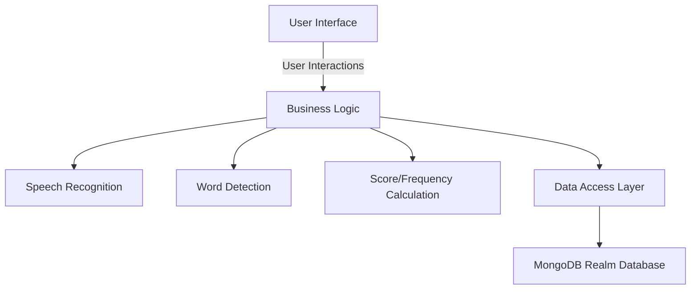
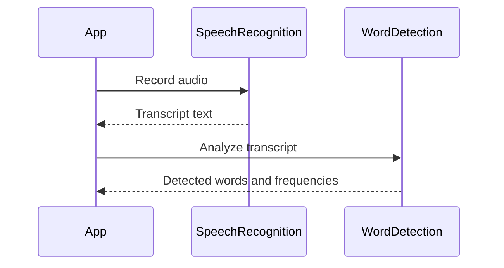
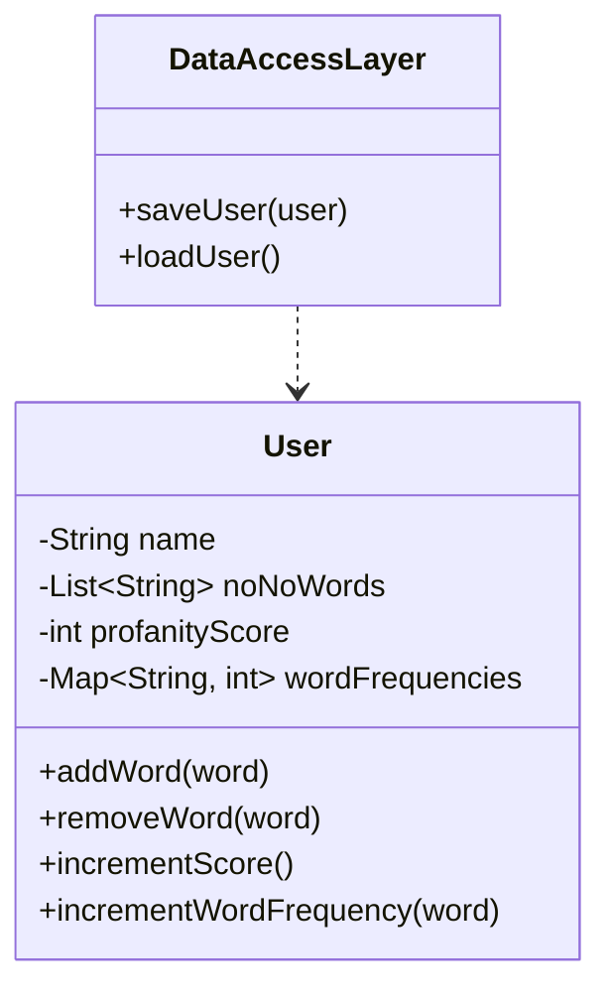
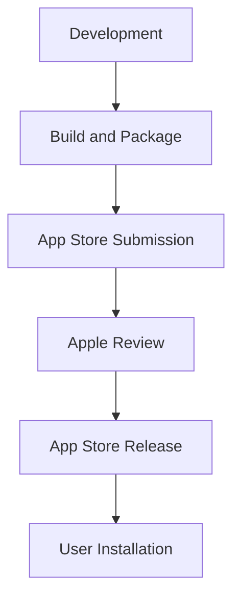

Relevant source files

The following files were used as context for generating this wiki page:

- [README.md](https://github.com/agattani123/swear-jar/blob/main/README.md)

# Deployment and Infrastructure

## Introduction

PottyMouth is an iOS application built using Swift that aims to help users improve their speaking habits by tracking and limiting the usage of certain words or phrases they want to avoid. The application records audio from the device's microphone (with user permission) and analyzes the speech to detect the occurrence of user-defined "no-no" words. It maintains a "profanity score" and word frequency statistics, which can be viewed in the Analytics section of the app.

The application utilizes the MongoDB Realm database to store user information, but it does not store the user's transcript due to privacy reasons. The deployment and infrastructure details for PottyMouth are not explicitly mentioned in the provided source files, but some inferences can be made based on the available information.

## Application Architecture

The application seems to follow a typical iOS app architecture, with the main components being:

1. User Interface (UI) Layer: Responsible for presenting the application's views and handling user interactions.
2. Business Logic Layer: Handles the core functionality of the application, such as speech recognition, word detection, and score/frequency calculation.
3. Data Access Layer: Manages the interaction with the MongoDB Realm database for storing and retrieving user information.

Sources: [README.md](https://github.com/agattani123/swear-jar/blob/main/README.md)

## Speech Recognition and Word Detection

The application likely utilizes iOS's built-in speech recognition capabilities or third-party libraries to convert the recorded audio into text. The text is then analyzed to detect the occurrence of user-defined "no-no" words.

Sources: [README.md](https://github.com/agattani123/swear-jar/blob/main/README.md)

## Data Storage and Retrieval

The application uses the MongoDB Realm database to store user information, such as the list of "no-no" words and potentially the profanity score and word frequencies. The data access layer handles the interaction with the database, likely through the Realm Swift SDK.

Sources: [README.md](https://github.com/agattani123/swear-jar/blob/main/README.md)

## Deployment and Distribution

As an iOS application, PottyMouth is likely deployed and distributed through the Apple App Store. The deployment process typically involves:

1. Building and packaging the application for distribution.
2. Submitting the application to the App Store for review.
3. Obtaining approval from Apple.
4. Releasing the application on the App Store for users to download and install.

Sources: [README.md](https://github.com/agattani123/swear-jar/blob/main/README.md)

## Conclusion

PottyMouth is an iOS application that helps users improve their speaking habits by tracking and limiting the usage of certain words or phrases. While the provided source files do not explicitly mention deployment and infrastructure details, it can be inferred that the application follows a typical iOS app architecture, utilizes iOS's speech recognition capabilities, stores user data in the MongoDB Realm database, and is deployed and distributed through the Apple App Store.