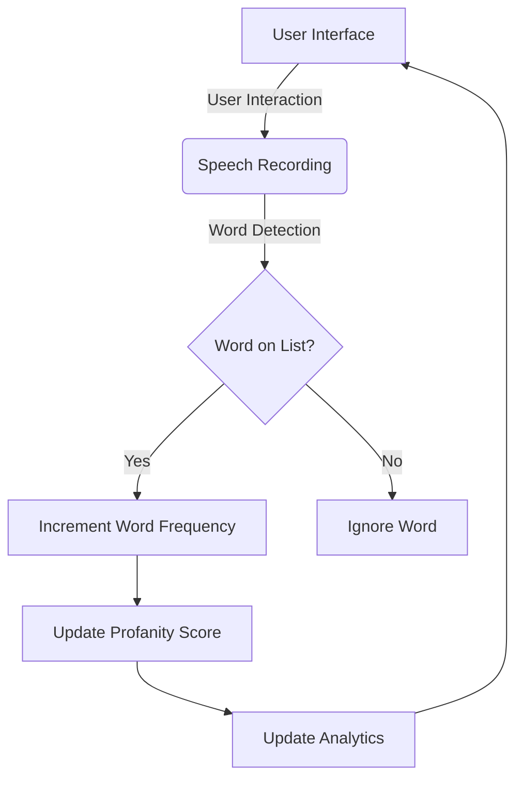
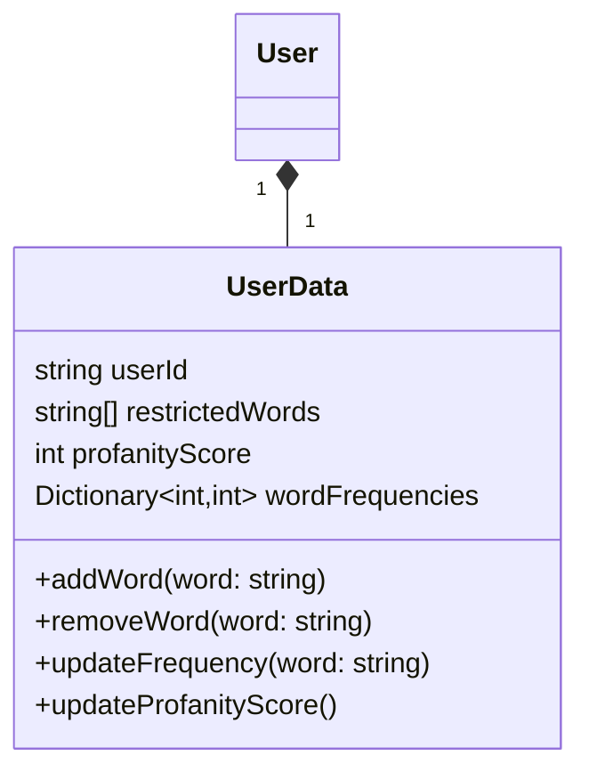

Relevant source files

The following files were used as context for generating this wiki page:

- [README.md](https://github.com/agattani123/swear-jar/blob/main/README.md)

# Deployment and Infrastructure

## Introduction

PottyMouth is an iOS application built using Swift that serves as a digital swear jar. It allows users to input words they want to limit or restrict in their speech, and then records their speech through the device's microphone. The app keeps track of the frequency of each restricted word used and calculates a "profanity score" based on the total occurrences. Users can view analytics on their word usage, add or remove words from their list, and potentially integrate with services like Venmo for donation or leaderboard features.

The application utilizes the MongoDB Realm database to store user information, but it does not store the user's speech transcript for privacy reasons. The deployment and infrastructure of PottyMouth primarily revolve around the iOS platform and the Realm database integration.

## iOS Application Architecture

### Application Flow

1. The user interacts with the iOS application's user interface to set up their list of restricted words and start the speech recording process.
2. The app begins recording the user's speech through the device's microphone.
3. As the user speaks, the app detects individual words and checks if each word is present in the user's restricted word list.
4. If the word is on the list, the app increments the frequency count for that specific word.
5. The app updates the overall "profanity score" based on the total occurrences of restricted words.
6. If the word is not on the list, the app ignores it.
7. The app updates the analytics section with the latest word frequencies and profanity score.
8. The user interface is updated to reflect the changes, and the process continues until the user stops the recording.

Sources: [README.md:3-11]()

### User Interface Components

The iOS application likely includes the following user interface components:

- Word List Management: Allows users to add, remove, or edit their list of restricted words.
- Recording Controls: Provides controls to start, pause, or stop the speech recording process.
- Analytics View: Displays the frequency of each restricted word used and the overall profanity score.

Sources: [README.md:3-11]()

## MongoDB Realm Integration

PottyMouth utilizes the MongoDB Realm database to store user information, such as the list of restricted words and potentially other user-specific data.

1. The `User` class represents an individual user of the PottyMouth application.
2. Each `User` has a corresponding `UserData` object that stores their user-specific information.
3. The `UserData` class contains properties to store the user's ID, list of restricted words, profanity score, and a dictionary to track the frequency of each restricted word.
4. The `UserData` class likely provides methods to add or remove words from the restricted list, update the frequency of a word when detected, and update the overall profanity score based on the word frequencies.
5. The Realm database is used to persist and retrieve the `UserData` objects for each user.

Sources: [README.md:9]()

## Deployment and Distribution

As an iOS application, PottyMouth is likely deployed and distributed through the Apple App Store. The deployment process would involve the following steps:

1. Building the iOS application package (`.ipa` file) for distribution.
2. Submitting the application package to the Apple App Store for review.
3. Upon approval, the application becomes available for download and installation on compatible iOS devices.

Users can then download and install the PottyMouth application from the App Store onto their iOS devices, such as iPhones or iPads.

Sources: [README.md:12]()

## Potential Future Enhancements

The README file mentions several potential future enhancements for PottyMouth:

1. **Educational and Charity Packages**: Creating specialized packages or versions of the app tailored for educational or charity contexts.
2. **Venmo Integration**: Integrating with the Venmo payment service to allow users to donate based on their profanity score or participate in leaderboards.
3. **Online Community**: Building an online community around PottyMouth, potentially with leaderboards and social features.

These enhancements would likely require additional infrastructure and integration with third-party services, such as Venmo's API for payment processing and potentially a dedicated server or cloud infrastructure for hosting the online community and leaderboard features.

Sources: [README.md:13-15]()

In summary, the deployment and infrastructure of PottyMouth primarily revolve around the iOS application architecture, integration with the MongoDB Realm database for user data storage, and distribution through the Apple App Store. Future enhancements may involve additional integrations and infrastructure components to support educational/charity packages, payment processing, and online community features.