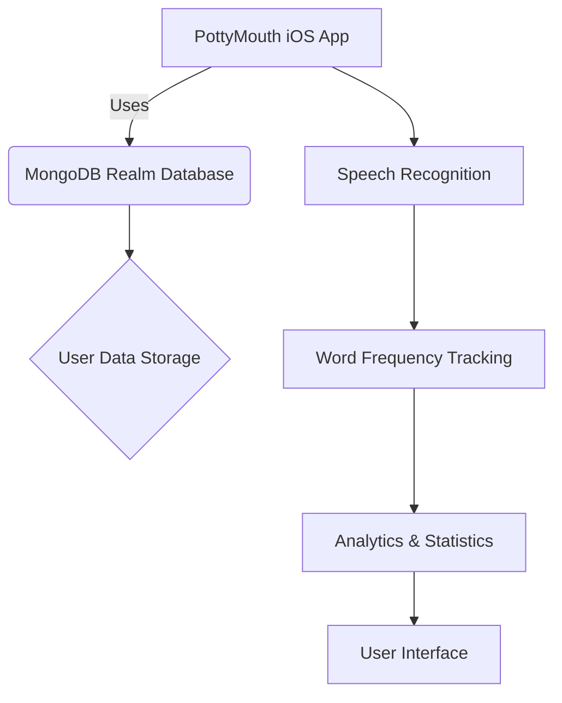
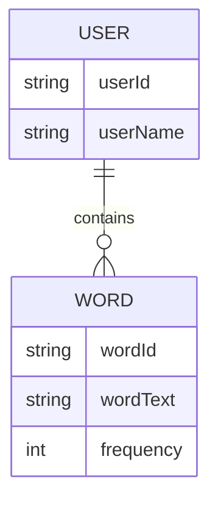

<details>
<summary>Relevant source files</summary>

The following files were used as context for generating this wiki page:

- [README.md](https://github.com/agattani123/swear-jar/blob/main/README.md)

</details>

# Getting Started

## Introduction

PottyMouth is an iOS application that acts as a digital swear jar, helping users monitor and limit their usage of certain words or phrases they want to avoid. The app listens to the user's speech through the device's microphone and keeps track of the frequency of the specified "no-no" words. It provides analytics and statistics to help users improve their speaking habits and vocabulary.

The primary use cases for PottyMouth include:

1. Household settings, where parents can use it to discourage their children from using inappropriate language.
2. Educational contexts, where students and teachers can improve their speaking habits and adhere to classroom policies.
3. Social gatherings or parties, where users can monitor and limit their use of certain words or phrases.

## Application Architecture



Sources: [README.md:1-24]()

The PottyMouth iOS application is built using Swift and follows a typical client-server architecture. The client-side iOS app handles the user interface, speech recognition, word frequency tracking, and analytics display. The MongoDB Realm database is used to store user information, but the user's speech transcript is not stored due to privacy reasons.

## User Flow

```mermaid
flowchart TD
    A[Launch App] --> B[Set "No-No" Words]
    B --> C[Grant Microphone Permission]
    C --> D[Start Recording]
    D --> E[Detect "No-No" Words]
    E --> F[Update Word Frequencies]
    F --> G[Display Analytics]
    G --> H[Add/Remove Words]
    H --> B
```

Sources: [README.md:5-13]()

1. The user launches the PottyMouth iOS app.
2. The user sets the list of "no-no" words they want to limit or avoid.
3. The app requests permission to access the device's microphone.
4. Once granted, the app starts recording the user's speech in the background.
5. The app detects any occurrences of the specified "no-no" words in the user's speech.
6. The app updates the frequency count for each detected word.
7. The app displays analytics and statistics on the usage of the "no-no" words.
8. The user can add or remove words from the list in real-time based on their needs.

## Analytics and Statistics

The app provides the following analytics and statistics to the user:

| Metric | Description |
| --- | --- |
| Total Profanity Score | The cumulative count of all "no-no" word occurrences. |
| Word Frequency | The number of times each individual "no-no" word was detected. |

Sources: [README.md:10-11]()

The Analytics section of the app allows users to view the frequency at which they said each of their "no-no" words, providing insights into their speaking habits and areas for improvement.

## Database Integration



Sources: [README.md:16]()

The MongoDB Realm database is used to store user information, including the user's ID, username, and the list of "no-no" words they have specified. However, the app strictly does not store the user's speech transcript or any audio recordings due to privacy reasons.

## Conclusion

PottyMouth is an innovative iOS application that helps users monitor and improve their speaking habits by tracking the usage of specific words or phrases they want to avoid. With its speech recognition capabilities, analytics, and user-friendly interface, PottyMouth provides a fun and effective way to promote better communication skills in various settings, from households to educational institutions and social gatherings.