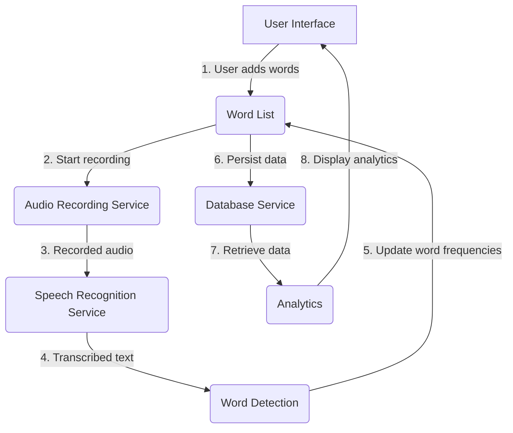

Relevant source files

The following files were used as context for generating this wiki page:

- [README.md](https://github.com/agattani123/swear-jar/blob/main/README.md)

# Getting Started

## Introduction

PottyMouth is an iOS application that serves as a digital swear jar, helping users monitor and limit their use of specific words or phrases they want to avoid. The app records audio through the device's microphone (with user permission) and tracks the frequency of occurrence for each "no-no" word added by the user. It provides analytics and insights into the user's speaking habits, enabling them to improve their vocabulary and communication skills.

The primary use cases for PottyMouth include:

1. **Household**: Parents can use the app to discourage their children from using inappropriate language.
2. **Educational**: Students and teachers can improve their speaking habits and adhere to classroom policies by monitoring their word usage.
3. **Social Settings**: The app can be used in parties or other social gatherings to create a fun and engaging environment while promoting positive language.

## Architecture

PottyMouth is built using Swift for iOS devices. The application follows a typical iOS app architecture, with the main components being:

### View Controllers

The app likely has one or more view controllers responsible for handling the user interface and interactions. These may include:

- `MainViewController`: Handles the main screen where users can add/remove words, start/stop recording, and view analytics.
- `SettingsViewController`: Manages app settings and preferences.
- `AnalyticsViewController`: Displays detailed analytics and insights into the user's word usage.

### Data Models

The app likely has data models to represent the core entities, such as:

- `Word`: Represents a "no-no" word added by the user, with properties like `name` and `frequency`.
- `User`: Represents the app user, storing their preferences and word list.

### Services

The app may have services or managers to handle specific functionalities, such as:

- `AudioRecordingService`: Manages the audio recording functionality, including starting/stopping recording and processing the audio data.
- `SpeechRecognitionService`: Integrates with speech recognition APIs (e.g., Apple's SpeechRecognizer) to transcribe the recorded audio and detect occurrences of "no-no" words.
- `DatabaseService`: Handles data persistence using MongoDB Realm, storing and retrieving user data and word lists.

### Data Flow

The overall data flow in the app can be represented as follows:

1. The user adds "no-no" words through the user interface, which updates the word list.
2. When the user starts recording, the Audio Recording Service is activated.
3. The recorded audio is passed to the Speech Recognition Service.
4. The Speech Recognition Service transcribes the audio and sends the text to the Word Detection component.
5. The Word Detection component checks for occurrences of "no-no" words and updates their frequencies in the word list.
6. The updated word list is persisted to the database using the Database Service.
7. When displaying analytics, the app retrieves the user's data from the database.
8. The analytics are displayed in the user interface.

Sources: [README.md](https://github.com/agattani123/swear-jar/blob/main/README.md)

## Key Features

| Feature | Description |
| --- | --- |
| Word List Management | Users can add, remove, and view their list of "no-no" words. |
| Audio Recording | The app records audio through the device's microphone (with user permission). |
| Speech Recognition | Recorded audio is transcribed using speech recognition APIs to detect occurrences of "no-no" words. |
| Word Frequency Tracking | The app keeps track of how many times each "no-no" word is said by the user. |
| Data Persistence | User data and word lists are stored using MongoDB Realm database. |
| Analytics | The app provides insights and analytics into the user's word usage, such as frequency of each word. |

Sources: [README.md](https://github.com/agattani123/swear-jar/blob/main/README.md)

## Potential Improvements

While the README file provides a good overview of the app's functionality, it lacks specific implementation details. Potential improvements to the wiki page could include:

- Architectural diagrams showing the relationships between different components (e.g., view controllers, services, data models).
- Sequence diagrams illustrating the flow of data and interactions between components during key processes like audio recording, speech recognition, and word detection.
- Code snippets (if available) demonstrating the implementation of critical functionalities, such as integrating with speech recognition APIs, updating word frequencies, and persisting data to the database.
- More detailed information about the data models, including their properties, relationships, and any constraints or validations.
- Explanation of any third-party libraries or frameworks used in the app (e.g., for speech recognition, audio processing, or database integration).
- Discussion of potential challenges or limitations, such as handling background audio recording, privacy concerns, or performance optimizations.

Sources: [README.md](https://github.com/agattani123/swear-jar/blob/main/README.md)

## Conclusion

PottyMouth is an innovative iOS application that aims to help users improve their communication skills and language habits by tracking and limiting the use of specific words or phrases. The app leverages audio recording, speech recognition, and data persistence technologies to provide an engaging and insightful experience. While the README file provides a good overview of the app's functionality, more detailed implementation specifics and architectural diagrams would enhance the wiki page's comprehensiveness.

Sources: [README.md](https://github.com/agattani123/swear-jar/blob/main/README.md)