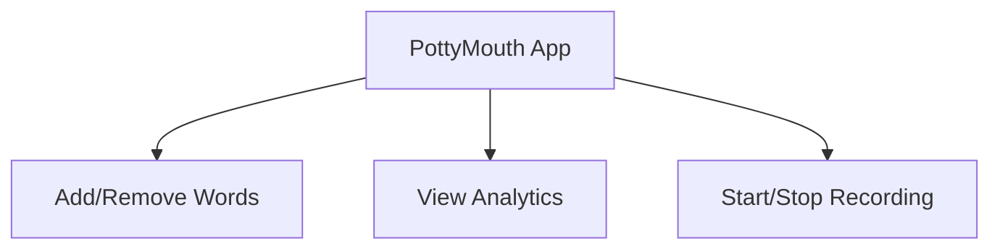
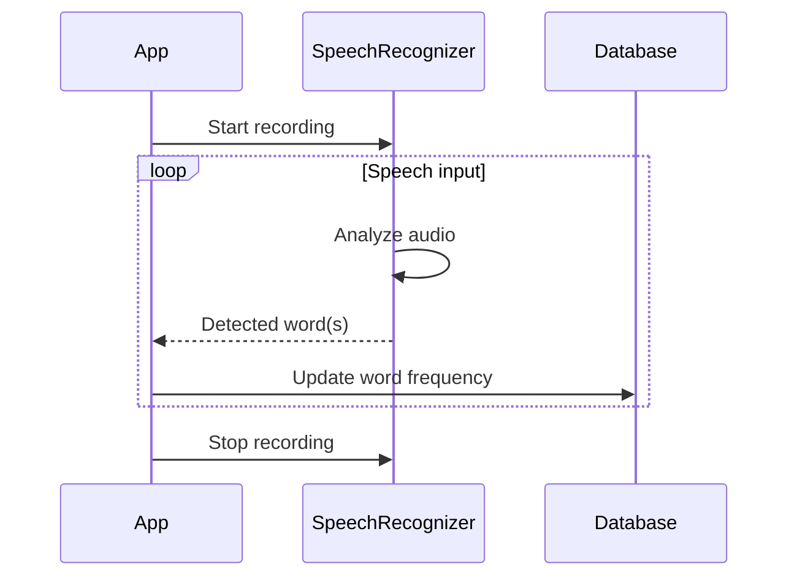

Relevant source files

The following files were used as context for generating this wiki page:

- [README.md](https://github.com/agattani123/swear-jar/blob/main/README.md)

# Introduction

PottyMouth is an iOS application that serves as a digital swear jar, designed to help users limit their usage of certain words or phrases they wish to avoid. The app listens to the user's speech through the device's microphone and tracks the frequency of specific "no-no" words or phrases added by the user. It provides analytics and statistics on the usage of these words, allowing users to monitor their progress and improve their speaking habits.

## Application Overview

PottyMouth is built using Swift for iOS devices. It utilizes the MongoDB Realm database to store user information, but does not store the user's speech transcript for privacy reasons. The app has several potential use cases, including:

- Household: Parents can use PottyMouth to discourage their children from using inappropriate language.
- Educational contexts: Students and teachers can improve their speaking habits and adhere to classroom policies by monitoring their word usage.
- Social settings: PottyMouth can be used in party or group settings to create a fun and engaging environment around limiting certain words or phrases.

Sources: [README.md:1-20]()

## User Interface

The application likely has a user interface that allows users to perform the following actions:

1. Add or remove words/phrases to their "no-no" list.
2. View analytics and statistics on the frequency of usage for each word/phrase.
3. Start and stop the speech recording functionality.

Sources: [README.md:5-10]()

## Speech Recognition and Word Tracking

PottyMouth utilizes the device's microphone to record the user's speech. It likely employs speech recognition techniques to analyze the audio and detect the presence of words or phrases from the user's "no-no" list.

When a word or phrase from the list is detected, the app updates the corresponding frequency count in the database. The app does not store the full speech transcript to protect user privacy.

Sources: [README.md:5-10]()

## Analytics and Statistics

PottyMouth provides an analytics section where users can view statistics on their usage of the "no-no" words or phrases. This likely includes:

| Statistic | Description |
| --- | --- |
| Total Profanity Score | The cumulative count of all detected "no-no" words/phrases. |
| Word Frequency | The number of times each specific word/phrase was detected. |

Users can also add or remove words/phrases from their list in real-time, allowing them to adapt the app's behavior to their changing needs.

Sources: [README.md:8-10]()

## Future Enhancements

The developers of PottyMouth have outlined several potential future enhancements, including:

- Creating packages for educational and charity contexts, tailoring the app's functionality to specific use cases.
- Integrating with payment apps like Venmo to enable users to donate to charities based on their profanity score.
- Implementing a leaderboard system to create an online community around the app and foster friendly competition.

Sources: [README.md:15-18]()

In summary, PottyMouth is a novel application that leverages speech recognition and analytics to help users improve their speaking habits by limiting the usage of certain words or phrases. Its potential use cases span various contexts, and the developers have outlined plans to expand its functionality and create a thriving community around the app.