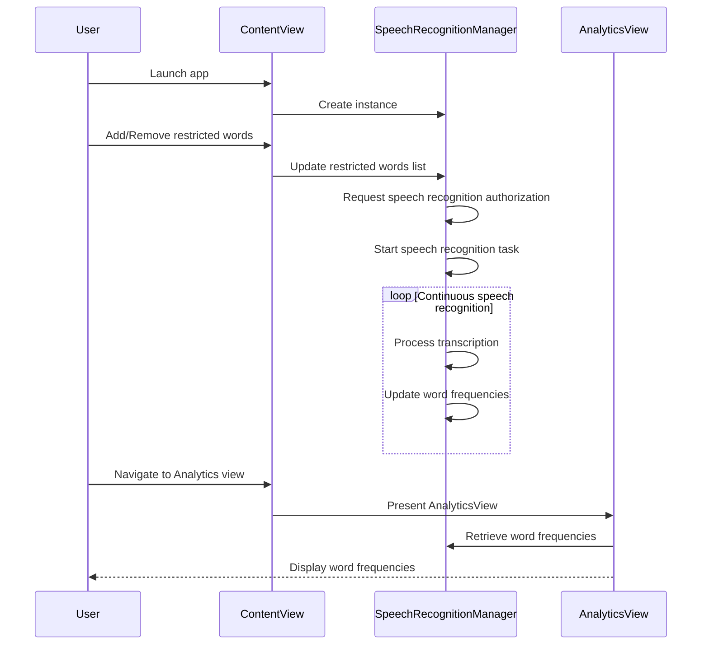

<details>
<summary>Relevant source files</summary>

The following files were used as context for generating this wiki page:

- [README.md](https://github.com/agattani123/swear-jar/blob/main/README.md)
- [PottyMouthApp.swift](https://github.com/agattani123/swear-jar/blob/main/PottyMouth/PottyMouthApp.swift)
- [ContentView.swift](https://github.com/agattani123/swear-jar/blob/main/PottyMouth/ContentView.swift)
- [AnalyticsView.swift](https://github.com/agattani123/swear-jar/blob/main/PottyMouth/AnalyticsView.swift)
- [SpeechRecognitionManager.swift](https://github.com/agattani123/swear-jar/blob/main/PottyMouth/SpeechRecognitionManager.swift)
</details>

# Introduction

PottyMouth is an iOS application that acts as a digital swear jar, helping users monitor and limit their usage of certain words or phrases they want to avoid. The app listens to the user's speech through the device's microphone and keeps track of the frequency of occurrence for each "no-no" word or phrase specified by the user. It provides an analytics section where users can view their usage statistics and manage their list of restricted words or phrases.

## Core Functionality

### Speech Recognition

The app utilizes the `SpeechRecognitionManager` class to handle speech recognition and transcription. This class leverages the `SFSpeechRecognizer` and `SFSpeechRecognitionTask` from the `Speech` framework to continuously listen to the user's speech and generate transcripts. Sources: [SpeechRecognitionManager.swift](https://github.com/agattani123/swear-jar/blob/main/PottyMouth/SpeechRecognitionManager.swift)

```swift
class SpeechRecognitionManager: ObservableObject {
    // ...
    private var recognitionTask: SFSpeechRecognitionTask?
    // ...

    func startRecording() throws {
        // Request speech recognition authorization
        SFSpeechRecognizer.requestAuthorization { authStatus in
            // ...
            if authStatus == .authorized {
                // Start speech recognition task
                self.recognitionTask = self.speechRecognizer?.recognitionTask(with: nil) { result, error in
                    // ...
                    self.processTranscription(result)
                }
            }
        }
    }

    private func processTranscription(_ result: SFSpeechRecognitionResult?) {
        // Process transcription and check for restricted words
    }
}
```

Sources: [SpeechRecognitionManager.swift:15-45](https://github.com/agattani123/swear-jar/blob/main/PottyMouth/SpeechRecognitionManager.swift#L15-L45)

### Restricted Words Management

The `ContentView` handles the user interface for managing the list of restricted words or phrases. Users can add or remove words from the list, which is stored in the `restrictedWords` array. Sources: [ContentView.swift](https://github.com/agattani123/swear-jar/blob/main/PottyMouth/ContentView.swift)

```swift
struct ContentView: View {
    @StateObject private var speechRecognitionManager = SpeechRecognitionManager()
    @State private var newWord = ""
    @State private var restrictedWords: [String] = []

    // ...

    var body: some View {
        // ...
        TextField("Add a new word", text: $newWord)
        Button("Add Word") {
            restrictedWords.append(newWord)
            newWord = ""
        }
        List(restrictedWords, id: \.self) { word in
            Text(word)
        }
        // ...
    }
}
```

Sources: [ContentView.swift:15-40](https://github.com/agattani123/swear-jar/blob/main/PottyMouth/ContentView.swift#L15-L40)

### Word Frequency Tracking

The `SpeechRecognitionManager` class is responsible for tracking the frequency of occurrence for each restricted word or phrase. It maintains a `wordFrequencies` dictionary that maps each word to its respective count. Sources: [SpeechRecognitionManager.swift](https://github.com/agattani123/swear-jar/blob/main/PottyMouth/SpeechRecognitionManager.swift)

```swift
class SpeechRecognitionManager: ObservableObject {
    // ...
    @Published var wordFrequencies: [String: Int] = [:]
    // ...

    private func processTranscription(_ result: SFSpeechRecognitionResult?) {
        guard let result = result else { return }
        let transcript = result.bestTranscription.formattedString

        // Check for restricted words in the transcript
        for word in restrictedWords {
            if transcript.lowercased().contains(word.lowercased()) {
                wordFrequencies[word, default: 0] += 1
            }
        }
    }
}
```

Sources: [SpeechRecognitionManager.swift:20-35](https://github.com/agattani123/swear-jar/blob/main/PottyMouth/SpeechRecognitionManager.swift#L20-L35)

### Analytics View

The `AnalyticsView` displays the frequency of occurrence for each restricted word or phrase. It retrieves the `wordFrequencies` data from the `SpeechRecognitionManager` and presents it in a list format. Sources: [AnalyticsView.swift](https://github.com/agattani123/swear-jar/blob/main/PottyMouth/AnalyticsView.swift)

```swift
struct AnalyticsView: View {
    @ObservedObject var speechRecognitionManager: SpeechRecognitionManager

    var body: some View {
        List(Array(speechRecognitionManager.wordFrequencies), id: \.key) { word, count in
            HStack {
                Text(word)
                Spacer()
                Text("\(count)")
            }
        }
        .navigationTitle("Analytics")
    }
}
```

Sources: [AnalyticsView.swift:10-21](https://github.com/agattani123/swear-jar/blob/main/PottyMouth/AnalyticsView.swift#L10-L21)

## Application Flow

The overall flow of the PottyMouth application can be represented by the following sequence diagram:



1. The user launches the PottyMouth app, which creates an instance of the `ContentView`.
2. The `ContentView` creates an instance of the `SpeechRecognitionManager`.
3. The user can add or remove restricted words or phrases through the `ContentView`.
4. The `ContentView` updates the list of restricted words in the `SpeechRecognitionManager`.
5. The `SpeechRecognitionManager` requests speech recognition authorization from the user.
6. Upon authorization, the `SpeechRecognitionManager` starts a speech recognition task to continuously listen to the user's speech.
7. As the user speaks, the `SpeechRecognitionManager` processes the transcription and updates the word frequencies for any restricted words or phrases detected.
8. The user can navigate to the `AnalyticsView` from the `ContentView`.
9. The `AnalyticsView` retrieves the word frequencies data from the `SpeechRecognitionManager` and displays it to the user.

Sources: [PottyMouthApp.swift](https://github.com/agattani123/swear-jar/blob/main/PottyMouth/PottyMouthApp.swift), [ContentView.swift](https://github.com/agattani123/swear-jar/blob/main/PottyMouth/ContentView.swift), [AnalyticsView.swift](https://github.com/agattani123/swear-jar/blob/main/PottyMouth/AnalyticsView.swift), [SpeechRecognitionManager.swift](https://github.com/agattani123/swear-jar/blob/main/PottyMouth/SpeechRecognitionManager.swift)

## Conclusion

PottyMouth is an iOS application that helps users monitor and limit their usage of certain words or phrases by leveraging speech recognition technology. It provides a user-friendly interface for managing a list of restricted words, continuously listens to the user's speech, and tracks the frequency of occurrence for each restricted word or phrase. The application presents an analytics view that displays the usage statistics, allowing users to identify and address their speaking habits.