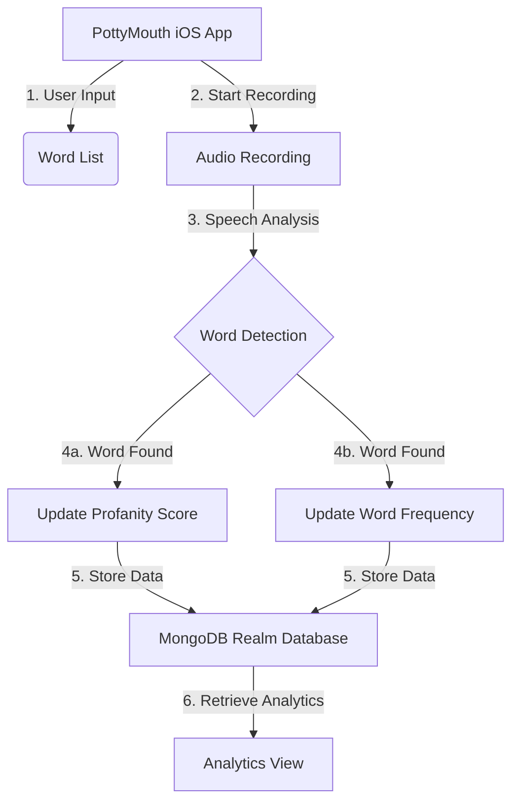

Relevant source files

The following files were used as context for generating this wiki page:

- [README.md](https://github.com/agattani123/swear-jar/blob/main/README.md)

# Introduction

PottyMouth is an iOS application that acts as a digital swear jar, allowing users to track and limit their usage of specific words or phrases they want to avoid. The app records audio through the device's microphone and analyzes the user's speech to detect the occurrence of the specified "no-no" words. It provides analytics on the frequency of each word used, enabling users to monitor and improve their speaking habits.

## Features

### Word Tracking

Users can add words or phrases they want to limit to a personal list within the app. PottyMouth listens to the user's speech through the device's microphone and detects the usage of any words from this list. It maintains a "profanity score" that increments each time a listed word is detected. Sources: [README.md:6-9]()

### Word Frequency Analytics

In addition to the overall profanity score, PottyMouth tracks the frequency of each individual word used from the user's list. The app provides analytics that display how often each word was said, allowing users to identify their most common verbal offenders. Sources: [README.md:9-10]()

### Real-time Word Management

Users can add or remove words from their list in real-time while the app is running. This flexibility allows users to adapt their word tracking based on changing needs or contexts. Sources: [README.md:10-11]()

## Architecture

1. The user inputs a list of words or phrases they want to track and limit.
2. The app starts recording audio through the device's microphone.
3. The recorded audio is analyzed for the presence of any words from the user's list.
4. When a listed word is detected:
   a. The overall "profanity score" is incremented.
   b. The frequency count for that specific word is incremented.
5. The profanity score and word frequencies are stored in a MongoDB Realm database.
6. The user can view the analytics, including the profanity score and the frequency of each word, in the app's Analytics View.

Sources: [README.md:6-11]()

## Data Storage

PottyMouth uses the MongoDB Realm database to store user information, including the word list and the associated profanity score and word frequencies. However, for privacy reasons, the app does not store the actual transcripts of the user's speech. Sources: [README.md:13]()

## Use Cases

### Household

PottyMouth can be used in a household setting as a digital swear jar, allowing parents to hold their children accountable for using inappropriate language without having to enforce the rules themselves. Sources: [README.md:14-15]()

### Educational

In educational contexts, students and teachers can use PottyMouth to improve their speaking habits and adhere to important classroom policies by monitoring the analytics and statistics provided by the app. Sources: [README.md:15-16]()

### Social Gatherings

The app can also be useful in party or social settings, where users may want to limit their use of certain words or phrases. The specific use cases in these contexts are not explicitly mentioned in the provided source files. Sources: [README.md:16-17]()

## Future Enhancements

The developers of PottyMouth have plans to extend the app's functionality and reach:

- Creating packages tailored for educational and charity contexts.
- Integrating with payment apps like Venmo to enable users to donate to charities based on their profanity score.
- Implementing a leaderboard system to foster an online community around the app.

Sources: [README.md:18-21]()