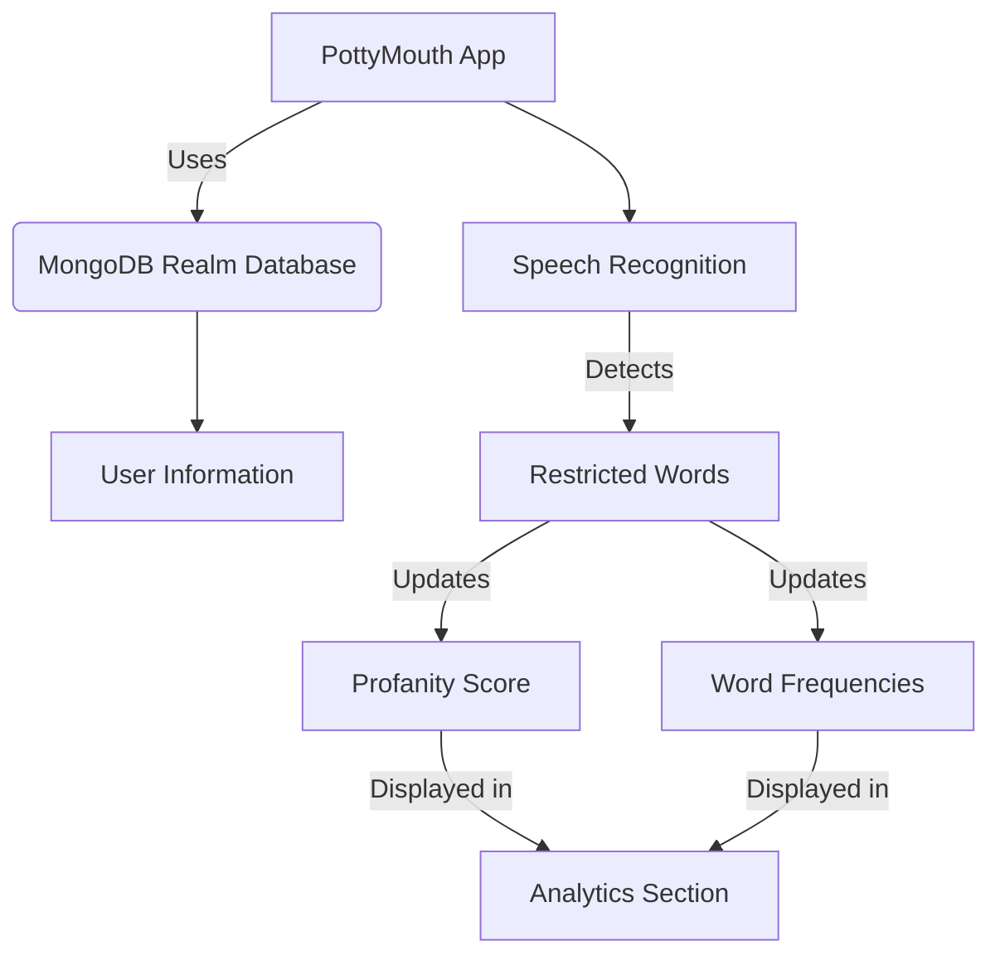

Relevant source files

The following files were used as context for generating this wiki page:

- [README.md](https://github.com/agattani123/swear-jar/blob/main/README.md)

# Introduction

PottyMouth is an iOS application that serves as a digital swear jar, helping users track and limit their usage of specific words or phrases they want to avoid. The primary purpose of the app is to promote better speaking habits and accountability by providing real-time monitoring and analytics on the frequency of using certain "no-no" words.

## Application Overview

PottyMouth allows users to create a list of words or phrases they want to restrict in their speech. With the user's permission, the app records audio through the device's microphone and analyzes the speech in real-time. Whenever a word from the user's list is detected, the app increments a "profanity score" and updates the frequency count for that specific word. Users can view their analytics, including the total score and the frequency of each restricted word, in the app's Analytics section. Additionally, users can add or remove words from their list on-the-fly, adapting the app's behavior to their changing needs.

The app is designed to be used in various contexts, such as households, classrooms, or social gatherings, to help individuals or groups improve their speaking habits and adhere to specific language policies or guidelines.

Sources: [README.md](https://github.com/agattani123/swear-jar/blob/main/README.md)

## Application Architecture

The PottyMouth application follows a client-server architecture, where the iOS app acts as the client, and the MongoDB Realm database serves as the server for storing user information. The app utilizes the device's microphone and speech recognition capabilities to detect restricted words in the user's speech. When a restricted word is detected, the app updates the overall "profanity score" and the frequency count for that specific word. These analytics are then displayed in the app's Analytics section, allowing users to monitor their progress and adjust their restricted word list as needed.

Sources: [README.md](https://github.com/agattani123/swear-jar/blob/main/README.md)

## Data Storage

PottyMouth uses the MongoDB Realm database to store user information, such as the list of restricted words and the associated analytics. However, to protect user privacy, the app does not store the actual transcripts of the user's speech.

Sources: [README.md](https://github.com/agattani123/swear-jar/blob/main/README.md)

## User Interface

The PottyMouth app likely consists of the following main components:

1. **Word List Management**: A section or view where users can add, remove, or modify the list of words they want to restrict.
2. **Analytics**: A view displaying the user's overall "profanity score" and the frequency of each restricted word.
3. **Microphone Permission**: A prompt or setting to request permission from the user to access the device's microphone for speech recognition.

Sources: [README.md](https://github.com/agattani123/swear-jar/blob/main/README.md)

## Future Enhancements

The README file mentions several potential future enhancements for PottyMouth:

1. **Educational and Charity Packages**: Developing specialized packages or versions of the app tailored for educational institutions and charitable organizations.
2. **Venmo Integration**: Integrating with the Venmo payment platform to enable users to donate to charities based on their profanity score, potentially creating a leaderboard or community around the app.
3. **Leaderboard and Community**: Implementing a leaderboard and online community features to foster engagement and friendly competition among users.

Sources: [README.md](https://github.com/agattani123/swear-jar/blob/main/README.md)

In summary, PottyMouth is an iOS application that aims to help users improve their speaking habits by tracking and limiting the usage of specific words or phrases. It leverages speech recognition, real-time analytics, and a user-defined list of restricted words to provide a digital swear jar experience. The app has potential applications in various settings, such as households, classrooms, and social gatherings, and the developers plan to expand its functionality and use cases in the future.