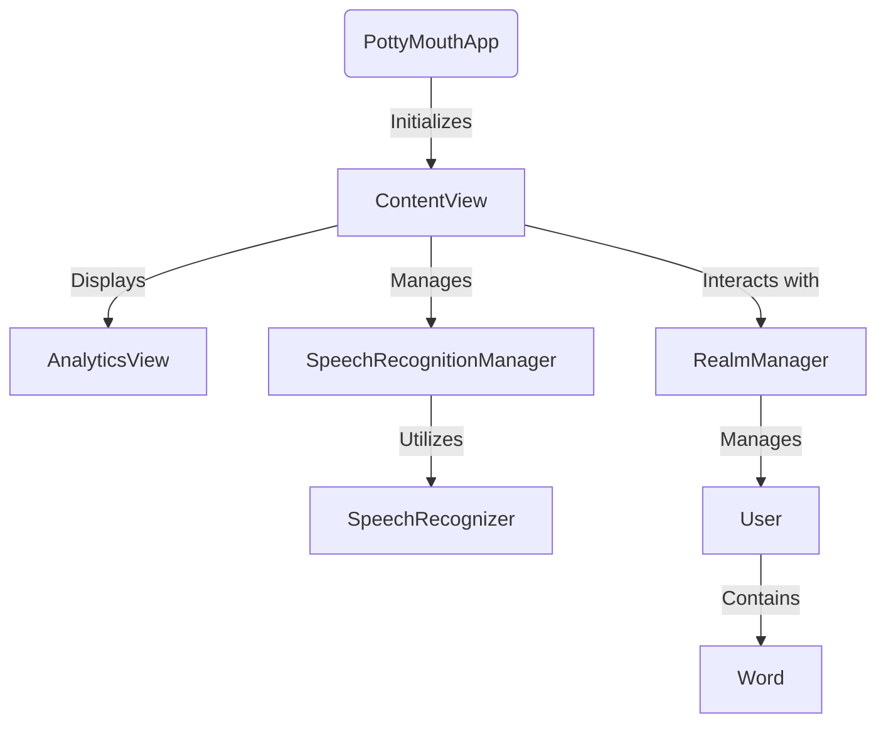
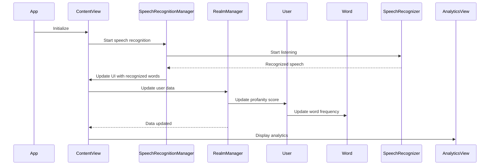

<details>
<summary>Relevant source files</summary>

The following files were used as context for generating this wiki page:

- [README.md](https://github.com/agattani123/swear-jar/blob/main/README.md)
- [PottyMouthApp.swift](https://github.com/agattani123/swear-jar/blob/main/PottyMouth/PottyMouthApp.swift)
- [ContentView.swift](https://github.com/agattani123/swear-jar/blob/main/PottyMouth/ContentView.swift)
- [AnalyticsView.swift](https://github.com/agattani123/swear-jar/blob/main/PottyMouth/AnalyticsView.swift)
- [SpeechRecognitionManager.swift](https://github.com/agattani123/swear-jar/blob/main/PottyMouth/SpeechRecognitionManager.swift)
- [RealmManager.swift](https://github.com/agattani123/swear-jar/blob/main/PottyMouth/RealmManager.swift)
- [User.swift](https://github.com/agattani123/swear-jar/blob/main/PottyMouth/User.swift)
- [Word.swift](https://github.com/agattani123/swear-jar/blob/main/PottyMouth/Word.swift)

</details>

# Introduction

PottyMouth is an iOS application designed to help users monitor and limit their usage of certain words or phrases they want to avoid, commonly referred to as "no-no" words. The app leverages speech recognition technology to listen to the user's speech and track the frequency of the specified words. It provides an analytics dashboard to visualize the usage statistics and allows users to manage their list of restricted words dynamically.

## Application Architecture

### App Structure

The PottyMouth app follows the Model-View-ViewModel (MVVM) architectural pattern, which separates the user interface (View) from the business logic (ViewModel) and data models (Model). This separation of concerns promotes code organization, testability, and maintainability.



Sources: [PottyMouthApp.swift](https://github.com/agattani123/swear-jar/blob/main/PottyMouth/PottyMouthApp.swift), [ContentView.swift](https://github.com/agattani123/swear-jar/blob/main/PottyMouth/ContentView.swift), [AnalyticsView.swift](https://github.com/agattani123/swear-jar/blob/main/PottyMouth/AnalyticsView.swift), [SpeechRecognitionManager.swift](https://github.com/agattani123/swear-jar/blob/main/PottyMouth/SpeechRecognitionManager.swift), [RealmManager.swift](https://github.com/agattani123/swear-jar/blob/main/PottyMouth/RealmManager.swift), [User.swift](https://github.com/agattani123/swear-jar/blob/main/PottyMouth/User.swift), [Word.swift](https://github.com/agattani123/swear-jar/blob/main/PottyMouth/Word.swift)

### Data Flow

The data flow in the PottyMouth app follows this sequence:



Sources: [ContentView.swift](https://github.com/agattani123/swear-jar/blob/main/PottyMouth/ContentView.swift), [SpeechRecognitionManager.swift](https://github.com/agattani123/swear-jar/blob/main/PottyMouth/SpeechRecognitionManager.swift), [RealmManager.swift](https://github.com/agattani123/swear-jar/blob/main/PottyMouth/RealmManager.swift), [User.swift](https://github.com/agattani123/swear-jar/blob/main/PottyMouth/User.swift), [Word.swift](https://github.com/agattani123/swear-jar/blob/main/PottyMouth/Word.swift)

## Speech Recognition

The `SpeechRecognitionManager` class handles the speech recognition functionality using the `SpeechRecognizer` from the `Speech` framework. It listens to the user's speech, transcribes it, and checks for the presence of any restricted words specified by the user.

```swift
class SpeechRecognitionManager: ObservableObject {
    // ...

    func startRecording() throws {
        // Request speech recognition authorization
        SFSpeechRecognizer.requestAuthorization { authStatus in
            // ...
            if authStatus == .authorized {
                // Start speech recognition
                self.recognitionTask = self.speechRecognizer?.recognitionTask(with: self.recognitionRequest, resultHandler: self.handleSpeechResult)
            }
        }
    }

    private func handleSpeechResult(_ result: SFSpeechRecognitionResult?, _ error: Error?) {
        // Handle speech recognition result
        // ...
    }
}
```

Sources: [SpeechRecognitionManager.swift:14-35](https://github.com/agattani123/swear-jar/blob/main/PottyMouth/SpeechRecognitionManager.swift#L14-L35)

## Data Storage

PottyMouth uses the MongoDB Realm database to store user data, including the list of restricted words and their usage frequencies. The `RealmManager` class manages the interaction with the Realm database, while the `User` and `Word` classes represent the data models.

```swift
class RealmManager: ObservableObject {
    private(set) var localRealm: Realm?
    @Published var user: User?

    init() {
        openRealm()
        getOrCreateUser()
    }

    private func openRealm() {
        do {
            let config = Realm.Configuration(schemaVersion: 1)
            Realm.Configuration.defaultConfiguration = config
            localRealm = try Realm()
        } catch {
            print("Error opening Realm: \(error)")
        }
    }

    private func getOrCreateUser() {
        if let localRealm = localRealm {
            user = localRealm.objects(User.self).first
            if user == nil {
                openRealm()
                user = User()
                saveUserData()
            }
        }
    }

    func saveUserData() {
        if let localRealm = localRealm, let user = user {
            do {
                try localRealm.write {
                    localRealm.add(user, update: .modified)
                }
            } catch {
                print("Error saving user data: \(error)")
            }
        }
    }
}
```

Sources: [RealmManager.swift](https://github.com/agattani123/swear-jar/blob/main/PottyMouth/RealmManager.swift), [User.swift](https://github.com/agattani123/swear-jar/blob/main/PottyMouth/User.swift), [Word.swift](https://github.com/agattani123/swear-jar/blob/main/PottyMouth/Word.swift)

## User Interface

The PottyMouth app has two main views: `ContentView` and `AnalyticsView`.

### ContentView

The `ContentView` is the main view of the app, where users can start and stop speech recognition, add or remove restricted words, and view their current profanity score.

```swift
struct ContentView: View {
    @StateObject private var speechRecognitionManager = SpeechRecognitionManager()
    @StateObject private var realmManager = RealmManager()
    @State private var newWord = ""

    var body: some View {
        VStack {
            // ...
            TextField("Add a new word", text: $newWord)
            Button(action: addWord) {
                Text("Add Word")
            }
            // ...
        }
        .environmentObject(speechRecognitionManager)
        .environmentObject(realmManager)
    }

    private func addWord() {
        if !newWord.isEmpty {
            realmManager.user?.addWord(newWord)
            realmManager.saveUserData()
            newWord = ""
        }
    }
}
```

Sources: [ContentView.swift](https://github.com/agattani123/swear-jar/blob/main/PottyMouth/ContentView.swift)

### AnalyticsView

The `AnalyticsView` displays the usage statistics for each restricted word, allowing users to visualize their progress and identify areas for improvement.

```swift
struct AnalyticsView: View {
    @EnvironmentObject var realmManager: RealmManager

    var body: some View {
        VStack {
            Text("Analytics")
                .font(.title)
            if let user = realmManager.user {
                List(user.words.sorted(by: { $0.frequency > $1.frequency })) { word in
                    HStack {
                        Text(word.value)
                        Spacer()
                        Text("\(word.frequency)")
                    }
                }
            } else {
                Text("No data available")
            }
        }
    }
}
```

Sources: [AnalyticsView.swift](https://github.com/agattani123/swear-jar/blob/main/PottyMouth/AnalyticsView.swift)

## Conclusion

PottyMouth is an iOS application that leverages speech recognition technology and a MongoDB Realm database to help users monitor and limit their usage of certain words or phrases. The app follows the MVVM architectural pattern and provides a user-friendly interface for managing restricted words and visualizing usage statistics. With its speech recognition capabilities and analytics dashboard, PottyMouth aims to promote better speaking habits and accountability in various contexts, such as households, classrooms, and social settings.